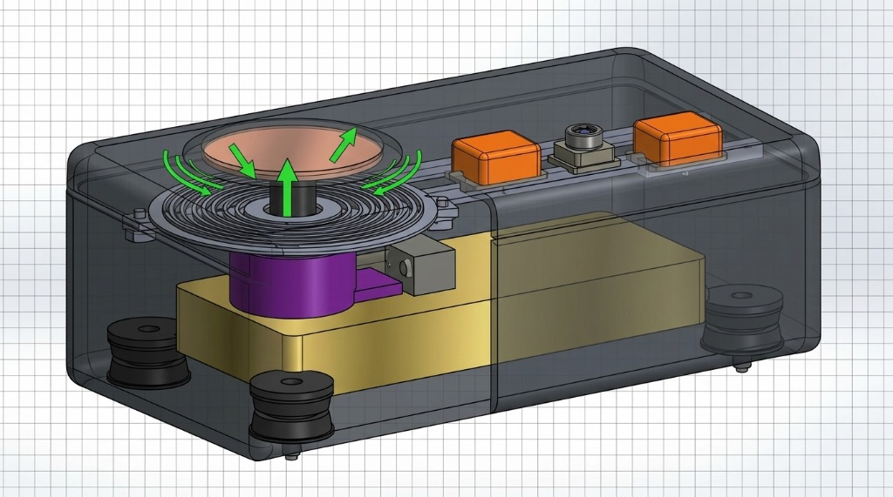
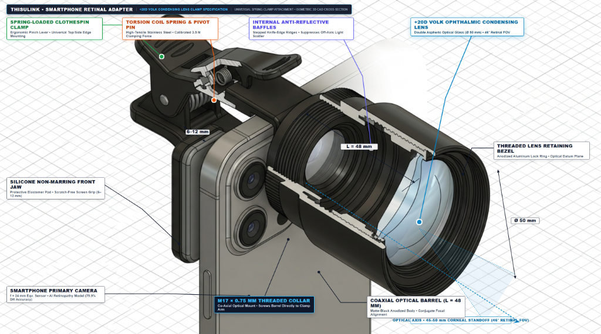

# THISULINK™ — Mechanical CAD Models & Subsystem Engineering Specifications

This directory contains the production 3D CAD models, cross-sectional mechanical schematics, and functional engineering specifications for both custom hardware diagnostic subsystems of THISULINK™.

---

## 1. Plantar Shear-Wave Elastography Platform (Isometric CAD Assembly)



### 1.1 Architectural Layout & Key Subsystems

The plantar platform is engineered for point-of-care biomechanical and thermal screening of the diabetic foot. It features a dual-bay internal architecture mounted on a solid C360 brass damping block inside a transparent, impact-resistant PETG enclosure:

```
┌────────────────────────────────────────────────────────────────────────┐
│  LEFT BAY: SWE TRANSDUCTION BAY        │ RIGHT BAY: ELECTRONICS & FIR  │
│                                        │                               │
│  [Plantar Copper Contact Plate]        │ [ESP32-S3] [MLX90621] [ESP32] │
│           ▲ (Z-axis excitation)        │               FIR Array       │
│  [Concentric Spiral Flexure Disc]      │                               │
│           ▲                            │                               │
│  [Linear Plunger & PTFE Bushing]       │                               │
│           ▲                            │                               │
│  [Voice Coil Actuator (10–300 Hz)]     │                               │
│  [TAL221 Load Cell: 1.40–1.60 N Gate]  │                               │
│  ============================= BRASS BASE ============================ │
│  [Vibration Isolator] [Isolator]       │ [Isolator]         [Isolator] │
└────────────────────────────────────────────────────────────────────────┘
```

### 1.2 Subsystem Specifications & Principles of Operation

| Subsystem / Component | Material / Model | Engineering Specifications | Functional Principle of Operation |
|---|---|---|---|
| **Plantar Pressure Plate** | Copper Alloy | $r = 28\text{ mm}$, $h = 5\text{ mm}$, raised rim | Couples directly with the patient's plantar heel pad / metatarsal head through a medical-grade silicone interface pad. |
| **Spiral Flexure Disc** | Beryllium Copper / Spring Steel | $r = 32\text{ mm}$, 8 concentric rings, $w = 1.5\text{ mm}$ | Constrains parasitic lateral wobble ($X/Y$), providing pure, frictionless linear translation strictly along the vertical ($Z$) axis. |
| **Voice Coil Actuator (VCA)** | Direct-Drive Housed VCA | $\varnothing 20\text{ mm} \times 25\text{ mm}$, $10 - 300\text{ Hz}$ sweep | Delivers an uncalibrated low-force perturbation ($0.100\text{ N}$ dynamic force), launching pure surface shear waves into plantar soft tissue without causing hyperelastic stiffening artifacts. |
| **Preload Gate / Interlock** | TAL221 Cantilever + HX711 | $47 \times 12 \times 6\text{ mm}$, $1.40\text{ N} - 1.60\text{ N}$ valid window | Enforces uniform contact pressure prior to sweep initiation. Prevents user bias: sweeps automatically abort if preload wanders outside the $1.50 \pm 0.10\text{ N}$ gate. |
| **Dual Pickups** | 2× ADXL355 Triaxial MEMS | LCC-14, $6.0 \times 6.0 \times 2.1\text{ mm}$, $25\ \mu\text{g}/\sqrt{\text{Hz}}$ | Positioned along a fixed, rigid baseline ($\Delta x = 40.0\text{ mm}$ with $x_1 = 105\text{ mm}$ and $x_2 = 145\text{ mm}$) to capture acoustic phase differences ($\Delta\phi$) with zero time-of-flight drift. |
| **Infrared Thermal Sensor** | Melexis MLX90621 | TO-39 can, $\varnothing 9.2\text{ mm}$, $16 \times 4$ FIR array | Non-contact thermal imaging capturing 64 pixels to identify localized pre-ulcerative inflammation ($\Delta T_{\text{contra}} \ge 2.2^\circ\text{C}$). |
| **Structural Base & Damping** | C360 Machined Brass + 4× SBR Rubber Isolators | $190 \times 98 \times 16\text{ mm}$ brass block | Heavy inertial foundation isolating the sensitive pickups from floor and bench vibrations. |

---

## 2. Smartphone 20D Retinal Imaging Adapter (Isometric 3D Cross-Section)



### 2.1 Optical & Mechanical Cross-Section

The retinal adapter transforms standard field smartphones into non-mydriatic indirect ophthalmoscopes for frontline diabetic retinopathy (DR) triage.

```
+-----------------------------------------------------------------------------------+
|  [Spring Clothespin Clamp]  <-- Ergonomic pinch lever (6–12 mm screen grip)       |
|           │                                                                       |
|  [Torsion Spring & Pin]     <-- Calibrated 3.5 N clamping force                   |
|           │                                                                       |
|  [M17 x 0.75mm Collar]      <-- Rigid optical axis alignment to smartphone lens   |
|           │                                                                       |
|  [Coaxial Optical Barrel]   <-- L = 48 mm matte-black anodized body               |
|    ├── Internal Baffles     <-- Stepped knife-edge ridges (suppress off-axis flare)|
|    ├── +20D Volk Lens       <-- Double aspheric optical glass (Ø 50 mm, 46° FOV)   |
|    └── Retaining Bezel      <-- Threaded anodized lock ring & datum plane         |
|           │                                                                       |
|      Optical Axis: 45–50 mm Corneal Standoff ---> Patient Eye                     |
+-----------------------------------------------------------------------------------+
```

### 2.2 Component Specifications & Principles of Operation

| Subsystem / Feature | Specification | Engineering Function |
|---|---|---|
| **Spring-Loaded Clothespin Clamp** | Ergonomic pinch lever, universal edge mount | Provides one-handed mounting over any standard field smartphone primary camera without slippage. |
| **Silicone Front Jaw** | Protective elastomer pad ($6 - 12\text{ mm}$ travel) | Protects smartphone touchscreen and display bezel from mechanical scratching while maintaining high friction. |
| **Torsion Coil Spring & Pivot Pin** | High-tensile stainless steel, $3.5\text{ N}$ force | Delivers consistent, calibrated clamping force ensuring the optical barrel remains perpendicular to the sensor. |
| **M17 $\times$ 0.75 mm Threaded Collar** | Precision aluminum thread | Rigid co-axial mounting allowing the optical barrel to screw directly and securely onto the clamp arm. |
| **Coaxial Optical Barrel** | Matte-black anodized aluminum ($L = 48\text{ mm}$) | Provides fixed conjugate focal alignment between the smartphone camera lens ($f = 24\text{ mm}$ eqv.) and the condensing lens. |
| **Internal Anti-Reflective Baffles** | Stepped knife-edge micro-ridges | Suppresses internal reflections, off-axis stray light, and smartphone LED flash backscatter. |
| **Condensing Lens** | +20D Volk Ophthalmic Lens ($\varnothing 50\text{ mm}$) | High-index double aspheric optical glass providing a clear $46^\circ$ retinal field of view at $45 - 50\text{ mm}$ corneal standoff distance. |
| **Threaded Retaining Bezel** | Anodized aluminum locking ring | Secures the +20D Volk lens rigidly against the optical datum plane without inducing glass stress or optical distortion. |

---

## 3. Parametric CAD Source Files

The parametric source scripts and 3D printing geometries are maintained in the [`models/`](models/) directory:

- **Plantar Platform Parametric Model:** [`models/thisulink_plantar_platform.scad`](models/thisulink_plantar_platform.scad)  
  *OpenSCAD model with full parametric control over enclosure dimensions, sensor baseline separation, VCA bobbin geometry, and spring flexure concentric rings.*

### How to Render and Export STL:
1. Open [`models/thisulink_plantar_platform.scad`](models/thisulink_plantar_platform.scad) in [OpenSCAD](https://openscad.org/).
2. Press **F5** for real-time 3D preview.
3. Press **F6** to compute CSG geometry and render solid manifold bodies.
4. Press **F7** to export `.stl` files for 3D printing in PETG / ABS.
