# THISULINK™ — Prototype Outputs (Screen-by-Screen Verification Guide)

This directory documents the verified prototype outputs and screenshots across the complete THISULINK ecosystem: Doctor Portal (Web), Health Worker Clinical Diagnostic Suite (Windows/Desktop), and Patient Health Companion (Mobile). To browse them as an interactive visual gallery, open [`index.html`](index.html) in your browser.

## Contents

- [System overview](#system-overview)
- [How these screenshots were made](#how-these-screenshots-were-made)
- [1. Doctor Portal (web)](#1-doctor-portal-web)
  - [1.1 Sign in](#11-sign-in)
  - [1.2 Complete your account (first sign-in)](#12-complete-your-account-first-sign-in)
  - [1.3 Triage command centre](#13-triage-command-centre)
  - [1.4 Triage queue filtered to one tier](#14-triage-queue-filtered-to-one-tier)
  - [1.5 Retinal fundus review](#15-retinal-fundus-review)
  - [1.6 Clinician sign-off of a DR grade](#16-clinician-sign-off-of-a-dr-grade)
  - [1.7 Tele-consult studio](#17-tele-consult-studio)
  - [1.8 AI diet plan: released](#18-ai-diet-plan-released)
  - [1.9 AI diet plan: flagged for review](#19-ai-diet-plan-flagged-for-review)
  - [1.10 Notifications](#110-notifications)
  - [1.11 e-Prescription: add medication](#111-e-prescription-add-medication)
  - [1.12 Consultation notes, prescription and signed report](#112-consultation-notes-prescription-and-signed-report)
  - [1.13 Account menu](#113-account-menu)
  - [1.14 Signed consultation report](#114-signed-consultation-report)
- [2. Health Worker app (Clinical Diagnostic Suite)](#2-health-worker-app-clinical-diagnostic-suite)
  - [2.1 Sign in](#21-sign-in)
  - [2.2 Complete your account](#22-complete-your-account)
  - [2.3 Patient registry (today's caseload)](#23-patient-registry-todays-caseload)
  - [2.4 Add new patient](#24-add-new-patient)
  - [2.5 Create patient app login](#25-create-patient-app-login)
  - [2.6 One-time password](#26-one-time-password)
  - [2.7 Approve an app sign-up](#27-approve-an-app-sign-up)
  - [2.8 Screening session](#28-screening-session)
  - [2.9 Foot scan with the probe](#29-foot-scan-with-the-probe)
  - [2.10 Glucose, blood pressure and fundus import](#210-glucose-blood-pressure-and-fundus-import)
  - [2.11 Patient history](#211-patient-history)
  - [2.12 Profile](#212-profile)
  - [2.13 Settings (probe, reminders, sync)](#213-settings-probe-reminders-sync)
- [3. Patient app (Health Companion)](#3-patient-app-health-companion)
  - [3.1 Sign in](#31-sign-in)
  - [3.2 Create your account](#32-create-your-account)
  - [3.3 Waiting for approval](#33-waiting-for-approval)
  - [3.4 First sign-in: details and new password](#34-first-sign-in-details-and-new-password)
  - [3.5 Home](#35-home)
  - [3.6 Readings and trends](#36-readings-and-trends)
  - [3.7 Record a reading](#37-record-a-reading)
  - [3.8 Consultations](#38-consultations)
  - [3.9 Diet plan](#39-diet-plan)
  - [3.10 Profile](#310-profile)

---

## System overview

THISULINK screens people with diabetes for complications in rural areas, using a 6-day monitoring cycle. It has three apps that share one backend:

| App | Who uses it | Platform | What it is for |
|---|---|---|---|
| **Doctor Portal** | Doctors and administrators | Web (Flutter web) | Works through the triage queue, reviews retinal images and confirms their grades, runs video tele-consultations, writes e-prescriptions and exports a signed PDF report. |
| **Health Worker app** (Clinical Diagnostic Suite) | Frontline health workers | Windows desktop and Android | Enrols patients and runs the daily screening session: foot scan with the THISULINK probe over Bluetooth, glucose and BP, and a fundus photo on days 1 and 4. It also sets up patients' app access. Sessions are saved on the device first and synced later, so it keeps working offline. |
| **Patient app** (Health Companion) | Patients | Android and iOS | Lets patients log glucose and BP, see their trends, join video consultations, read their prescriptions and follow their AI diet plan. |

**Backend: PocketBase.** A single PocketBase server stores every record: users (with a `role`), patients, vitals, foot-scan, retinal, triage results, tele-consult sessions, care plans and doctor notifications. Server hooks handle the rest:

- **Triage.** Each new reading recomputes the patient's tier from their latest reading of each type. The tiers are Green (normal), Yellow (moderate), Orange (high risk) and Red (emergency). When a patient becomes Orange or Red, the hook raises an alert for their health worker.
- **Accounts.** Health workers can create a mobile-number login for a patient, which comes with a one-time password. They can also approve a patient's self sign-up by matching the email address.
- **AI diet plans.** When a doctor completes a tele-consultation with notes, a care plan is queued. A background job asks an LLM (Groq) to turn the doctor's remarks into a structured one-day plan. A second model call reviews the plan, and fixed rule checks run alongside it (the doctor's restrictions are respected, no high-sugar foods, targets in sensible ranges). Together these produce a **quality score**. At 92 % or above the plan is **released**. Below that it is **flagged**: the patient still sees it, and the doctor gets a notification asking them to review it or press **Regenerate**.
- **Video.** Tele-consultations use **LiveKit**. PocketBase issues the room token only to the doctor, health worker and patient on that consultation.

## How these screenshots were made

- All data is **fictional** and was loaded into a **local test PocketBase**. No production server was contacted. This is why some screens show a server address of `http://127.0.0.1:8099`.
- The fundus images are **synthetic illustrations**, not real retinal photographs.
- The AI diet plans came from the real care-plan pipeline (queue → generate → review → score → release or flag). A local stand-in for the LLM supplied the model replies.
- The health-worker foot scan used the app's built-in **simulated probe stream**. That mode deliberately blocks **Submit session**, so no synthetic reading can be saved against a patient.
- Live video could not be shown because the local server has no LiveKit keys. The studio is shown before a call starts.
- The signed PDF report (1.14) was built from the Doctor Portal's built-in demo data in a Flutter test and rendered to an image.
- Doctor Portal and Patient app were captured from their web builds in a headless browser. The Patient app used a phone-sized viewport. The Health Worker app was captured from its Windows desktop build.

---

## 1. Doctor Portal (web)

Used by: **doctors** (and administrators). Signed in here as *Dr. Lukesh M*.

### 1.1 Sign in

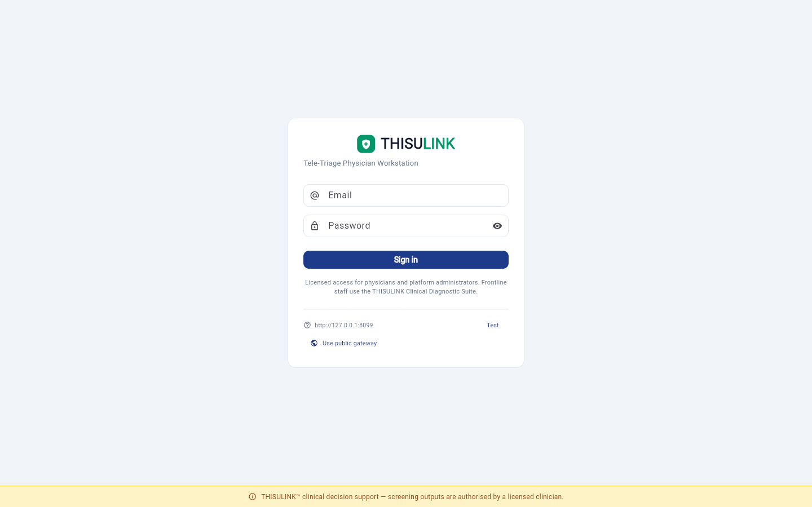

The entry point to the physician workstation.

- **Email / Password.** Staff accounts are created by an administrator. Only accounts with the `doctor` or `admin` role can sign in here. Health workers are told to use the mobile/desktop app instead.
- **Server row (bottom).** Shows the server the portal is using and has a **Test** button that checks it. On a portal served over plain `http` there is also a switch between the public gateway and a LAN server, so a field camp without internet can use a PocketBase on the local network.
- **Disclaimer bar.** Present on every page: screening outputs are decision support and must be authorised by a licensed clinician.

### 1.2 Complete your account (first sign-in)

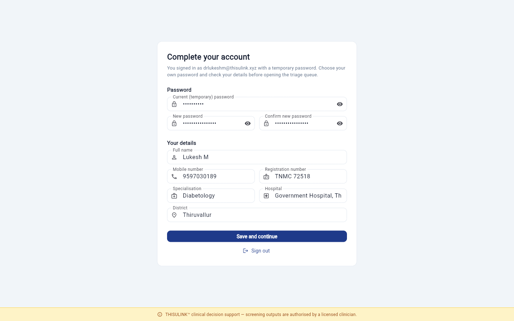

Shown at `#/welcome` the first time a doctor signs in with the temporary password an administrator gave them. Every other page stays locked until this is done.

- **Password.** Enter the temporary password, then choose and confirm a new one (at least 8 characters, and different from the temporary one).
- **Your details.** Full name, mobile number, medical **registration number** (printed on signed reports), specialisation, hospital and district. The form is pre-filled from what the administrator entered.
- **Save and continue** saves everything and opens the triage queue. **Sign out** leaves without saving.

### 1.3 Triage command centre

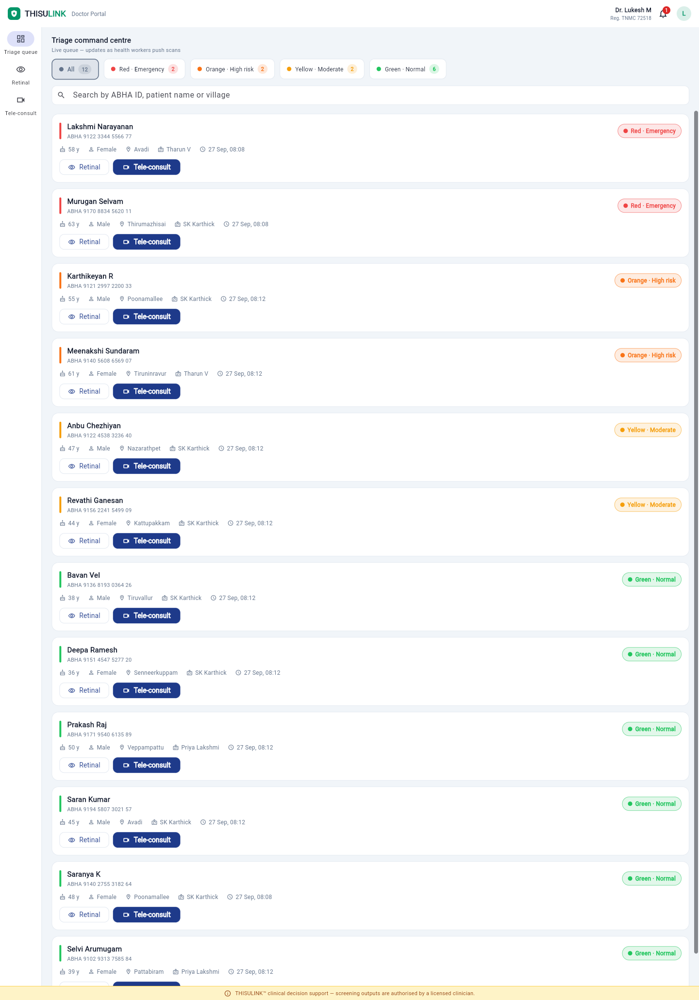

The doctor's home screen: a live queue of every patient, ordered by urgency.

- **Top bar.** The doctor's name and registration number, a **notification bell** with an unread count (see 1.10), and the **account** avatar (see 1.13).
- **Left rail.** **Triage queue**, **Retinal** (fundus review) and **Tele-consult** (the studio).
- **Tier filter chips.** *All*, *Red · Emergency*, *Orange · High risk*, *Yellow · Moderate* and *Green · Normal*, each with its count.
- **Search.** Search by ABHA ID, patient name or village.
- **Patient cards.** Each card has a colour bar for the tier and shows the name, ABHA number, age, gender, village, assigned health worker and last update. Red patients are always listed first. **Retinal** opens the fundus review and **Tele-consult** opens the studio for that patient. Clicking the card itself opens the retinal review.
- The queue updates in real time as health workers upload readings.

### 1.4 Triage queue filtered to one tier

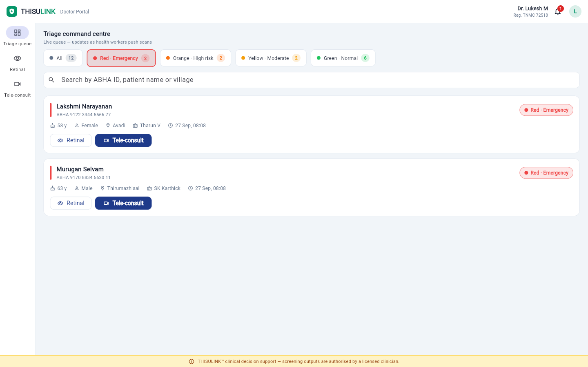

The same queue with only the **Red · Emergency** chip selected, so the doctor sees just the emergencies. In this example, one patient is Red because of diabetic neuropathy found on the foot scan (tissue class C). The other is Red because of referable diabetic retinopathy at grade 3.

### 1.5 Retinal fundus review

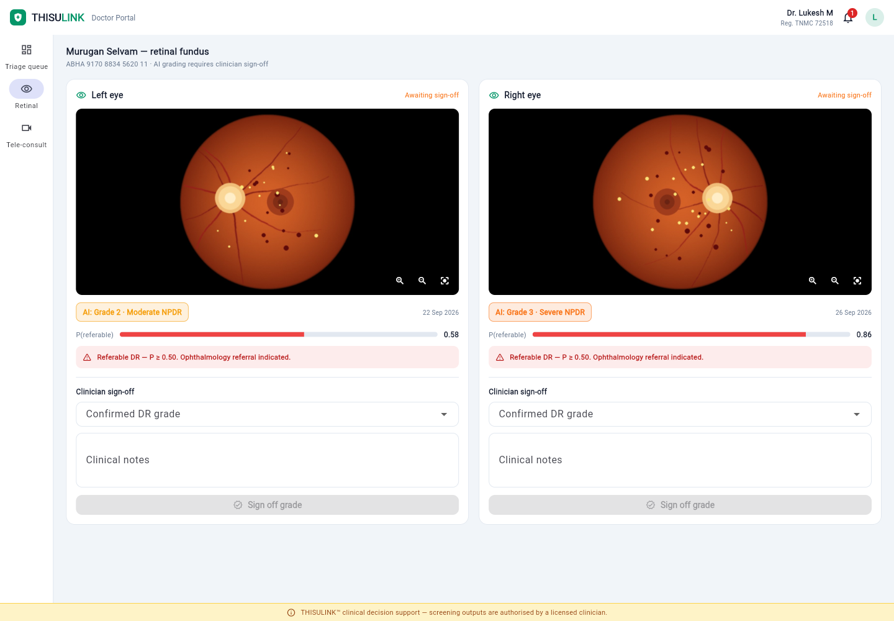

Side-by-side review of the left and right fundus photos taken by the health worker.

- **Image viewer.** Zoom in, zoom out and reset the view. The image can also be dragged or pinched.
- **AI grade chip.** The on-device/server model's ICDR diabetic retinopathy grade (0 = no DR … 4 = proliferative DR) and the date of the capture.
- **P(referable) bar.** The model's probability that the DR is referable. At 0.50 or above a red banner appears: *Referable DR — ophthalmology referral indicated*.
- **Awaiting sign-off.** Shown until a clinician confirms the grade. The AI grade is never treated as final on its own.

### 1.6 Clinician sign-off of a DR grade

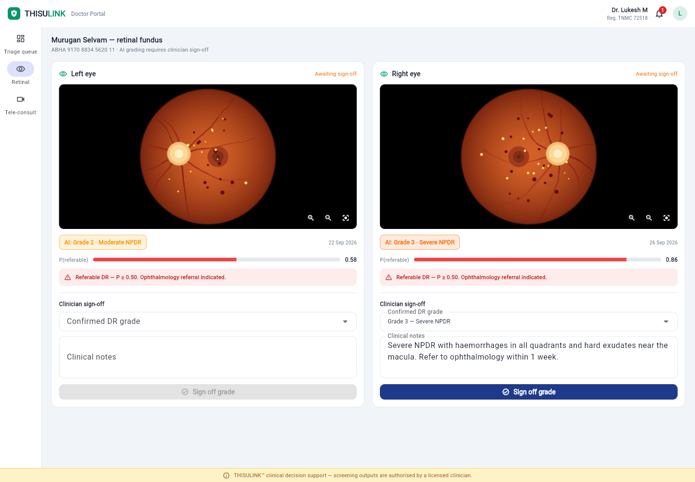
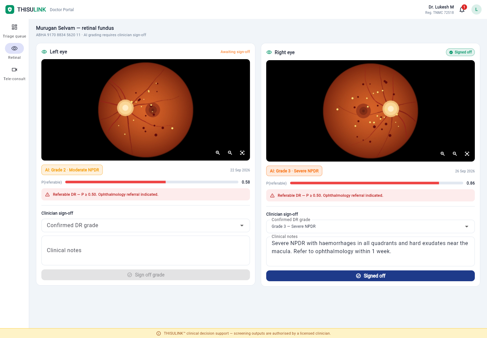

- **Confirmed DR grade.** The doctor either confirms the AI grade or picks a different one from the drop-down.
- **Clinical notes.** Free-text findings and the follow-up plan.
- **Sign off grade.** Saves the confirmed grade, the doctor's name and the time. The eye's status then changes to **Signed off**. From this point triage uses the doctor's grade instead of the AI's.

### 1.7 Tele-consult studio

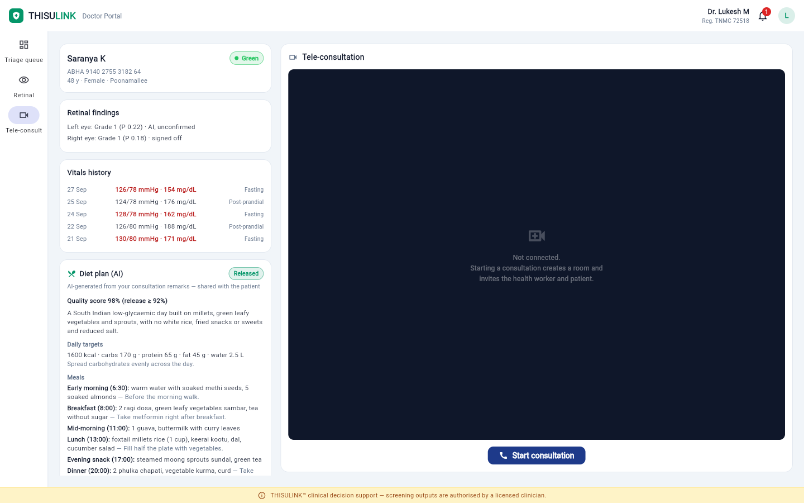

The studio has two panes. The left pane holds the patient's clinical context and the right pane holds the video call.

- **Patient card.** Name, triage tier, ABHA number, age, gender and village.
- **Retinal findings.** A short summary per eye: grade, probability and whether a doctor has signed it off.
- **Vitals history.** The last five readings (BP and glucose), with out-of-range values in red and the reading type (fasting or post-prandial).
- **Video pane.** **Start consultation** creates or reuses a LiveKit room and invites the health worker and the patient. The patient app then shows a *Join* button. While the call is running there are camera, microphone and **End** controls. Ending the call saves the notes and prescription and marks the consultation *completed*, which triggers the AI diet plan.

### 1.8 AI diet plan: released

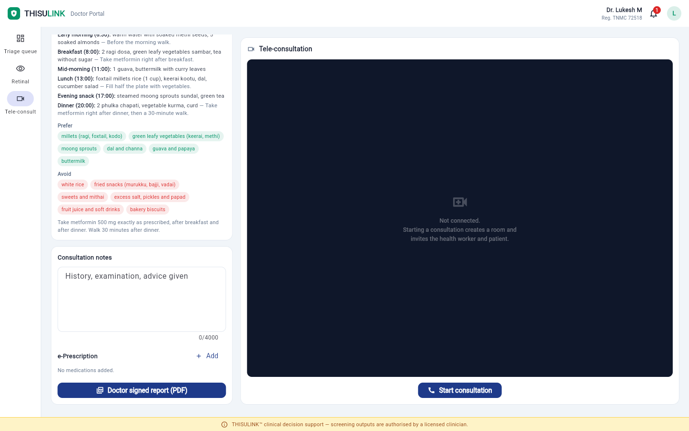

Further down the left pane is the **Diet plan (AI)** card for the patient's latest completed consultation.

- **Status chip.** *Generating…*, *Released*, *Flagged* or *Failed*.
- **Quality score.** The combined rule and reviewer score, compared with the 92 % release threshold (98 % here).
- **Plan body.** A summary, daily targets (kcal, carbohydrate, protein, fat, water), meals with times and notes, and **Prefer** (green) and **Avoid** (red) food chips. This is the same plan the patient sees.

### 1.9 AI diet plan: flagged for review

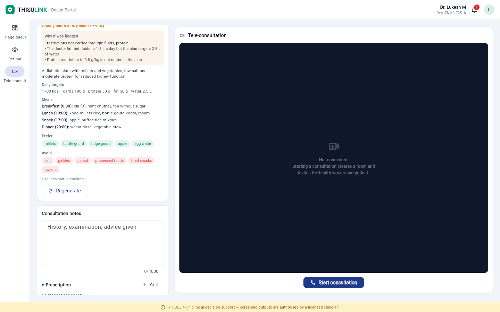

A plan that scored below 92 % (82 % here).

- **Why it was flagged.** The rule-check problems and the reviewer's issues. Here the plan ignored the doctor's fluid and protein limits.
- **Regenerate.** Queues a new plan built from the same consultation remarks. The newest plan replaces the older ones for the patient.
- The patient can still see a flagged plan, but the doctor is notified (see 1.10).

### 1.10 Notifications

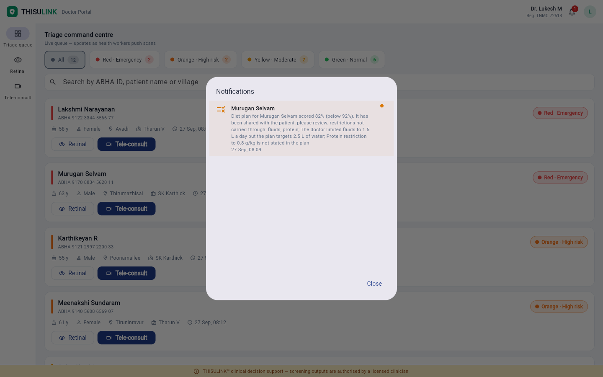

Opened from the bell in the top bar. It lists diet-plan events for this doctor's patients: *low accuracy* (flagged) and *failed* (the plan could not be generated after retries). Each entry shows the patient, the reason and the time. An orange dot marks an unread entry, and clicking an entry marks it read.

### 1.11 e-Prescription: add medication

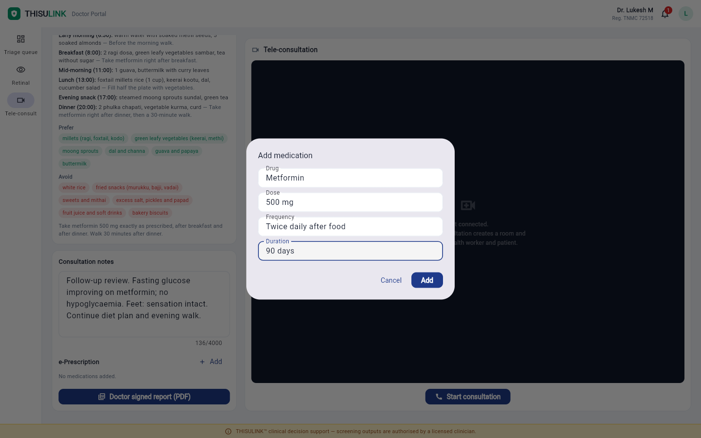

Opened with **+ Add** under *e-Prescription*. Fields: **Drug**, **Dose**, **Frequency** and **Duration**. Each medication becomes one line of the structured prescription, which the patient sees in their Consults tab.

### 1.12 Consultation notes, prescription and signed report

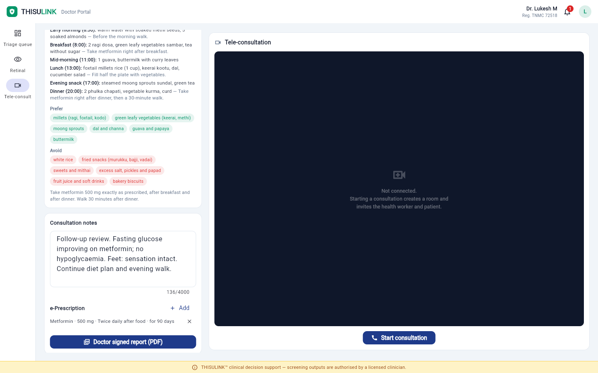

- **Consultation notes.** History, examination and advice (up to 4000 characters). The AI diet plan is generated from these notes.
- **e-Prescription list.** Each medication can be removed with the ×.
- **Doctor signed report (PDF).** Builds and downloads a report containing the patient header, retinal findings, recent vitals, notes, prescription and the current diet plan, electronically signed with the doctor's name and registration number.

### 1.13 Account menu

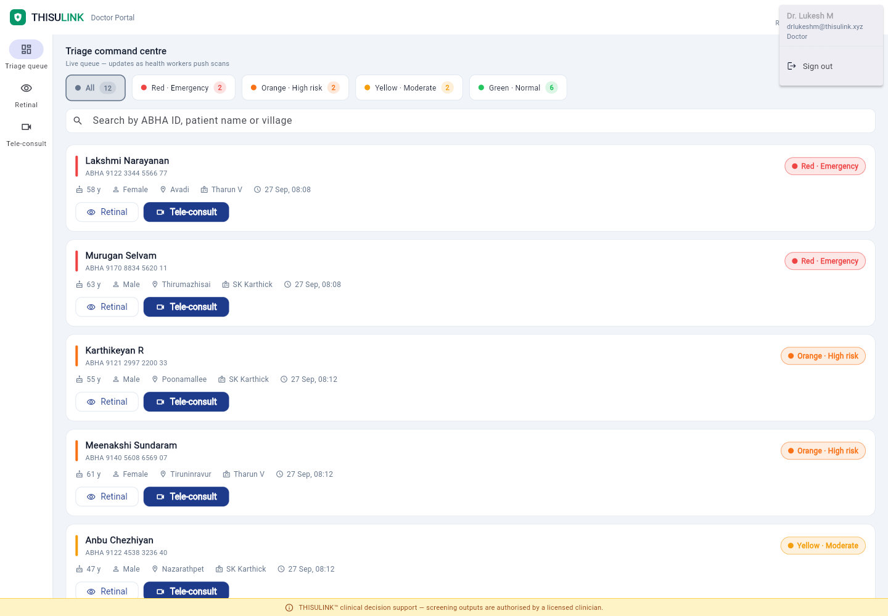

Opened from the avatar at the top right. It shows the signed-in doctor's name, email and role, and has **Sign out**.

### 1.14 Signed consultation report

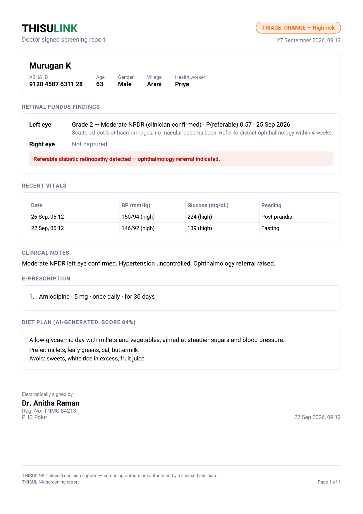

The PDF produced by **Doctor signed report (PDF)** (see 1.12), shown here for a demo patient with a referable retinal finding.

- **Header.** THISULINK wordmark, the patient's triage tier and urgency, and the date and time the report was generated.
- **Patient block.** Name, ABHA ID, age, gender, village and health worker.
- **Retinal fundus findings.** The latest capture of each eye: grade, whether it is AI-only or clinician confirmed, P(referable) and date, with the doctor's notes. A red banner appears when referable diabetic retinopathy is detected.
- **Recent vitals, clinical notes, e-Prescription and diet plan.** The last few readings, the consultation notes, each prescribed medication, and the summary and prefer/avoid lists of the current AI diet plan with its accuracy score.
- **Signature.** Electronically signed with the doctor's name, registration number and PHC. The intended-use disclaimer and page number are on every page.
- Text is set in Roboto, embedded in the PDF, so symbols such as the em dash (—) and ™ print correctly.

---

## 2. Health Worker app (Clinical Diagnostic Suite)

Used by: **frontline health workers**. Signed in here as *SK Karthick*. The screenshots are from the Windows desktop build. The Android build has the same screens.

### 2.1 Sign in

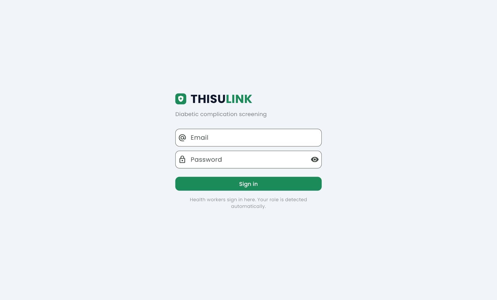

Email and password sign-in. The role is detected automatically. The last signed-in health worker can also sign in offline, because a local credential is kept on the device.

### 2.2 Complete your account

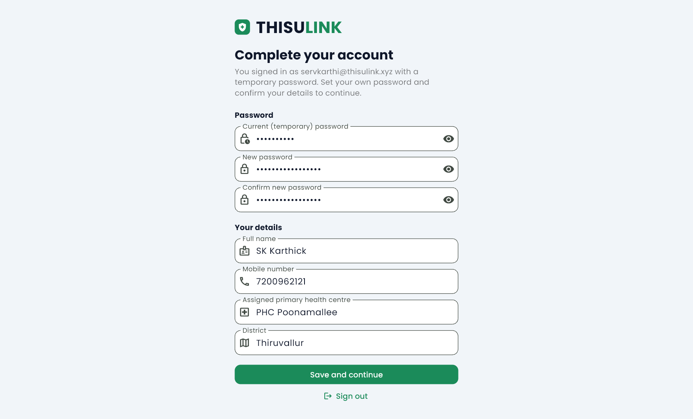

Shown on first sign-in with a temporary password. Every other screen stays blocked until it is done.

- **Password.** Current (temporary) password, then the new password twice.
- **Your details.** Full name, mobile number, assigned primary health centre and district.
- **Save and continue** or **Sign out**.

### 2.3 Patient registry (today's caseload)

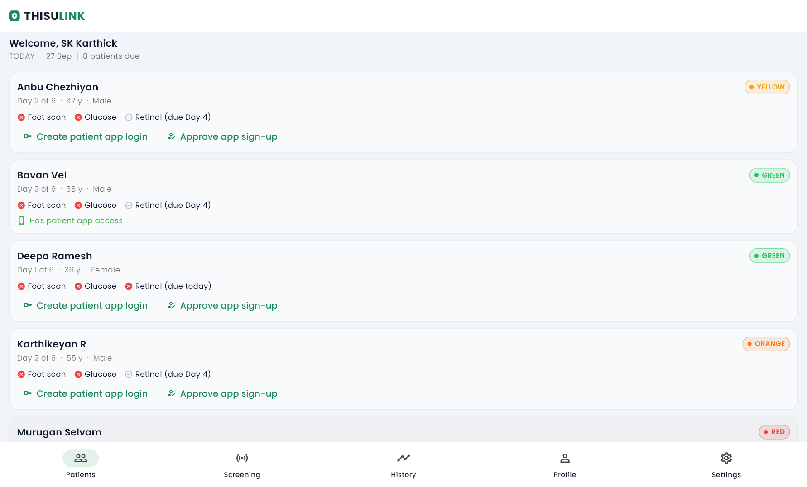
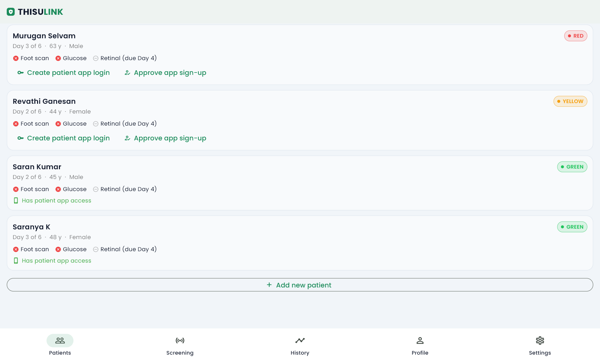

The health worker's home tab: every patient assigned to them.

- **Header.** A greeting, today's date and the number of patients due.
- **Patient card.** Name, day of the 6-day cycle, age, gender and triage tier. Ticks show what is still due today: **Foot scan**, **Glucose** and **Retinal**. Retinal is due on days 1 and 4.
- **Patient app access.** A card shows either *Has patient app access*, or two actions: **Create patient app login** (see 2.5) and **Approve app sign-up** (see 2.7).
- Clicking a card opens that patient's **Screening** session.
- **Add new patient** at the bottom of the list (see 2.4).
- **Bottom navigation.** Patients, Screening, History, Profile and Settings.

### 2.4 Add new patient

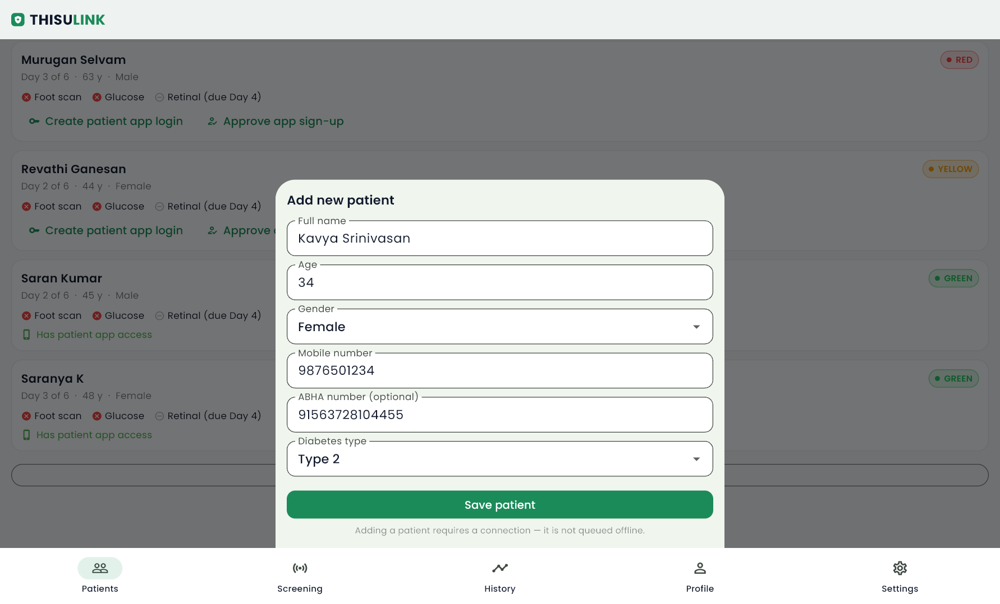

Enrols a patient into the health worker's caseload. Fields: **Full name**, **Age**, **Gender**, **Mobile number** (later used as the patient's app username), **ABHA number** (optional, 14 digits) and **Diabetes type**. Adding a patient needs a connection to the server and is not queued offline.

### 2.5 Create patient app login

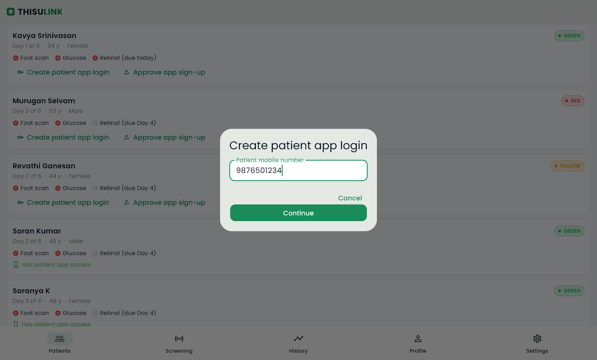

Creates a Health Companion login for a patient who does not have one. The patient's mobile number is pre-filled and becomes their username.

### 2.6 One-time password

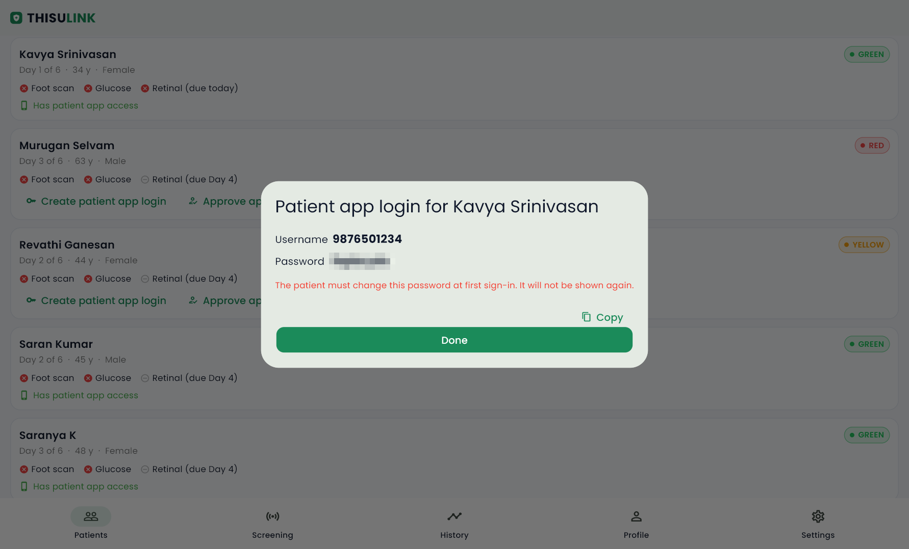

The server generates a one-time password (blurred here) and shows it **only once**, with a **Copy** button. The health worker gives it to the patient, who must change it at first sign-in (see 3.4).

### 2.7 Approve an app sign-up

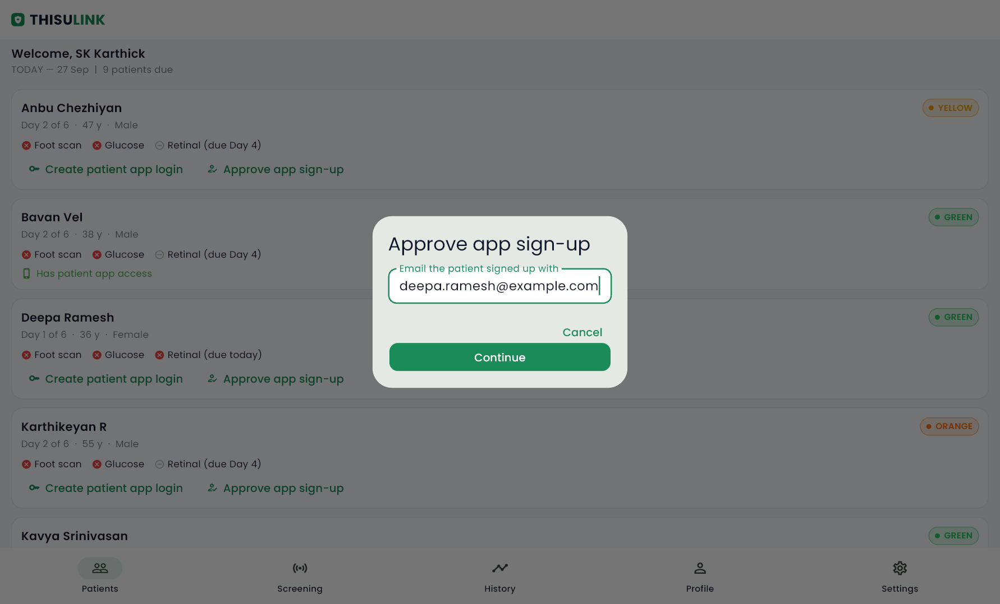
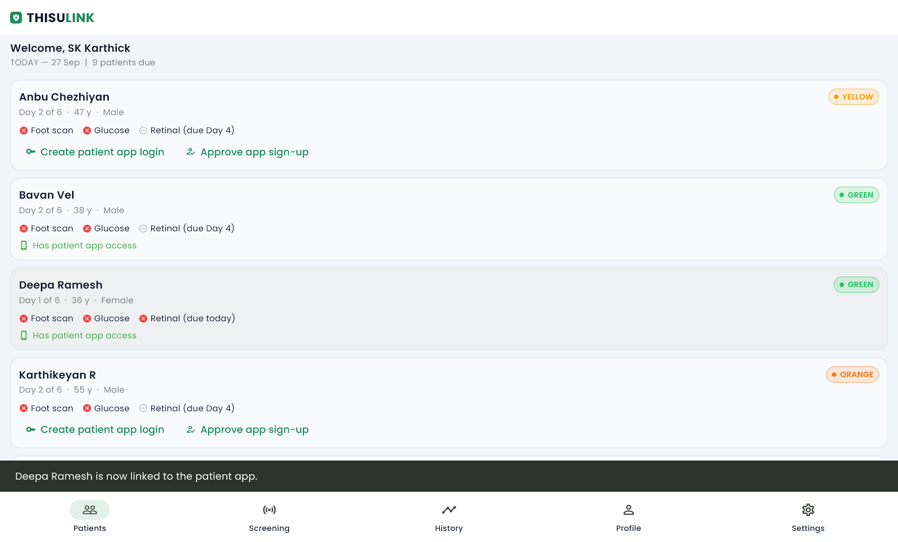

For patients who created their own account in the patient app (see 3.2 and 3.3). The health worker enters the email the patient signed up with. The server checks that the account is a patient account not linked to anyone else, then links it to this patient record. A confirmation appears and the card changes to *Has patient app access*.

### 2.8 Screening session

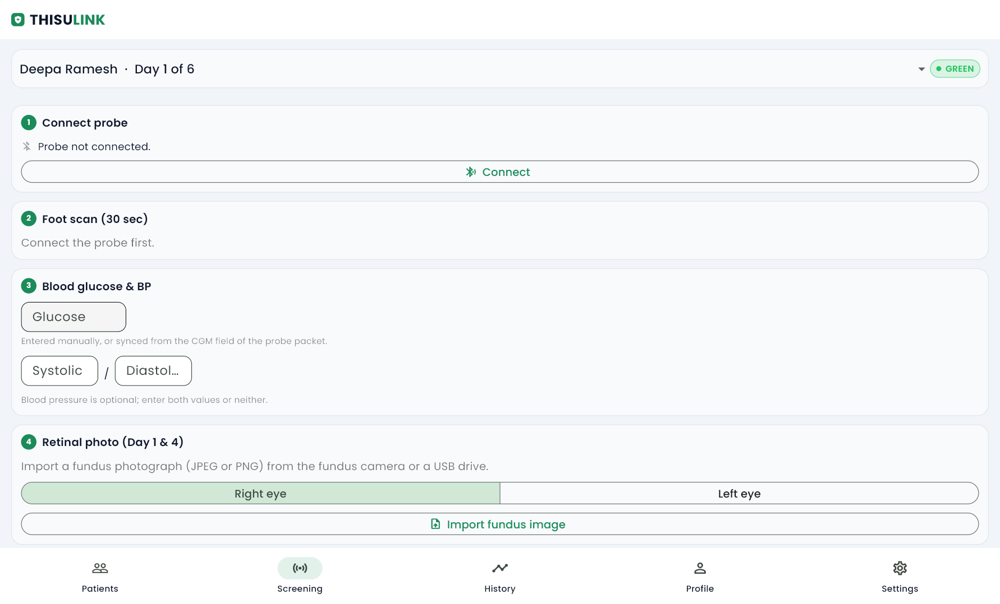

The daily session for one patient. The drop-down at the top switches between patients and shows each one's cycle day and tier. There are four numbered steps:

1. **Connect probe.** Pair with the THISULINK foot probe over Bluetooth (WinRT on Windows).
2. **Foot scan (30 sec).** Available once the probe is connected.
3. **Blood glucose & BP.** Enter glucose manually or take the CGM value from the probe. BP is optional.
4. **Retinal photo (Day 1 & 4).** Import a fundus photo for the right or left eye.

**Submit session** saves everything locally first, then uploads it when there is a connection.

### 2.9 Foot scan with the probe

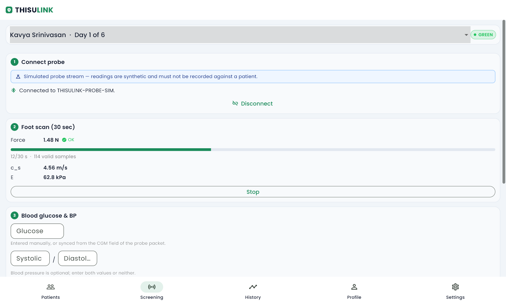
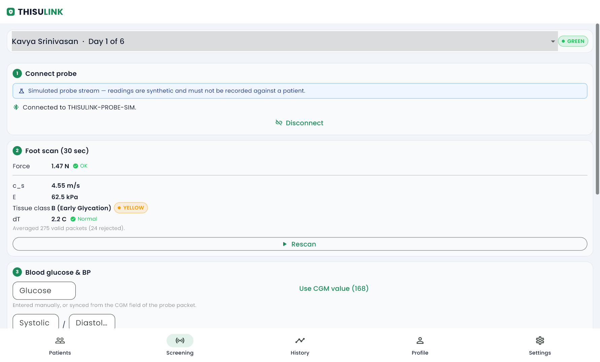

- **While scanning.** A live **contact force** reading with an OK check (the accepted window is 1.40–1.60 N), a progress bar with the count of valid samples, and running values for shear-wave speed (c_s) and Young's modulus (E).
- **Result.** Averaged c_s and E, the **tissue class** (A healthy, B early glycation, C diabetic neuropathy) with its tier colour, and the **thermal asymmetry dT** between the feet (2.2 °C is the escalation threshold). It also shows how many packets were used and how many were rejected. **Rescan** repeats the scan.
- The blue banner shows that the **simulated probe stream** is on. It exists for demos and training, and a session recorded with it cannot be submitted.

### 2.10 Glucose, blood pressure and fundus import

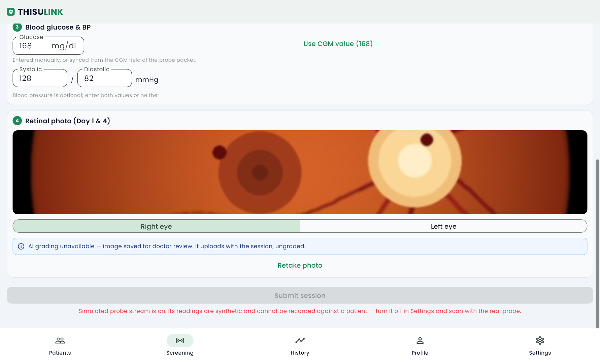

- **Glucose** in mg/dL. **Use CGM value** copies the value from the probe packet.
- **Systolic / Diastolic** in mmHg (shown here as 128 / 82). Optional, but if one is entered both are required.
- **Retinal photo.** Choose *Right eye* or *Left eye*, then **Import fundus image** (JPEG or PNG from the fundus camera or a USB drive). The image is previewed with **Retake** and **Use this**. The app then grades it with the on-device ONNX model, or with the server when the model is not available. If neither is available (as on the test server here), the image is kept **ungraded for doctor review**.
- **Submit session** stays disabled while the simulated probe is on.

### 2.11 Patient history

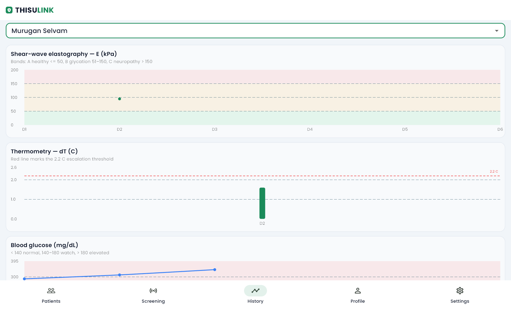
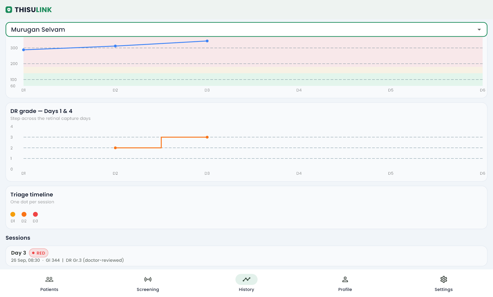

Trends across the 6-day cycle for the selected patient:

- **Shear-wave elastography (E, kPa)**, with bands for A (50 or below), B (51–150) and C (above 150).
- **Thermometry (dT, °C)**, with a red line at the 2.2 °C threshold.
- **Blood glucose (mg/dL)**, with normal, watch and elevated bands.
- **DR grade**, drawn as a step across the retinal capture days.
- **Triage timeline** (one dot per session) and the **Sessions** list, with the day, tier, glucose and DR grade, including whether the grade was reviewed by a doctor.

Sessions pulled from the server get their tier from the same triage rules as a session recorded on the device, using the latest reading of each kind up to that day. Murugan Selvam, shown here, goes from YELLOW (glucose 288) to ORANGE (referable DR, glucose 312) to RED (doctor-confirmed grade 3), which matches his RED tier on the server. A session with nothing to triage on (blood pressure only, for example) is shown as a grey UNKNOWN, never as GREEN. A reading without a stored cycle day is placed on the day the server would give it: the count of distinct visit days (IST) so far, wrapping after day 6.

### 2.12 Profile

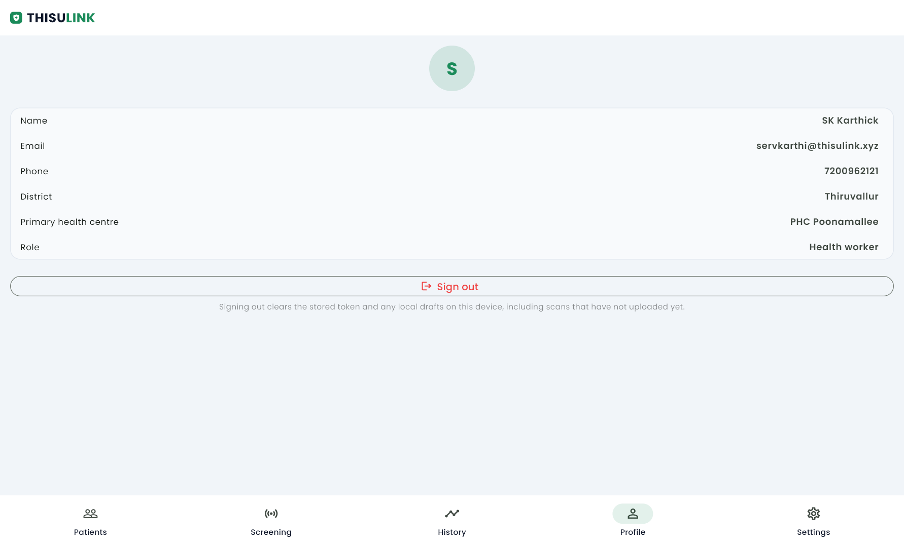

The signed-in health worker's name, email, phone, district, primary health centre and role, with **Sign out**. Signing out clears the stored token and any local drafts, including scans that have not uploaded yet.

### 2.13 Settings (probe, reminders, sync)

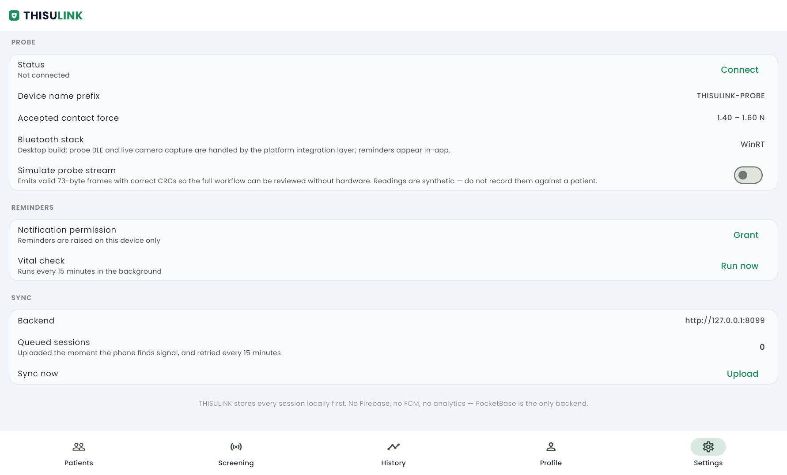

- **Probe.** Connection status and Connect, the device-name prefix, the accepted contact force, the Bluetooth stack, and the **Simulate probe stream** switch for demos.
- **Reminders.** Notification permission, and a **Vital check** that normally runs every 15 minutes in the background (on Android), with **Run now**.
- **Sync.** The backend address in use, the number of **queued sessions** waiting to upload, and **Sync now → Upload**.

---

## 3. Patient app (Health Companion)

Used by: **patients**. Signed in here as *Saranya K*. The screenshots use a phone-sized screen.

### 3.1 Sign in

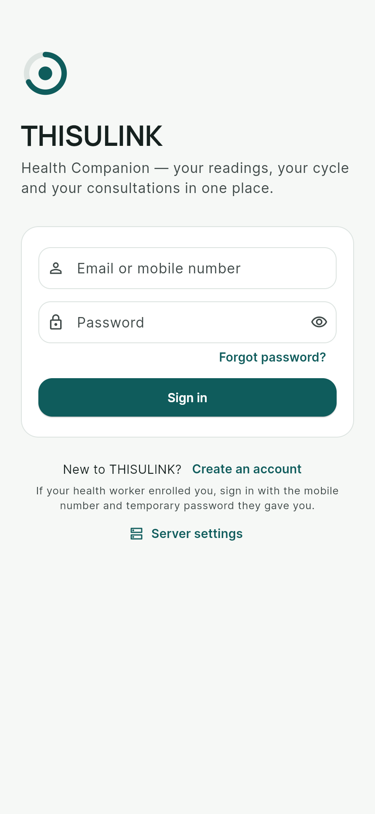

- **Email or mobile number** and **Password**. A patient enrolled by a health worker signs in with their mobile number and the temporary password they were given.
- **Forgot password?**, **Create an account** (see 3.2) and **Server settings** (to point the app at a local-network server in a field camp).

### 3.2 Create your account

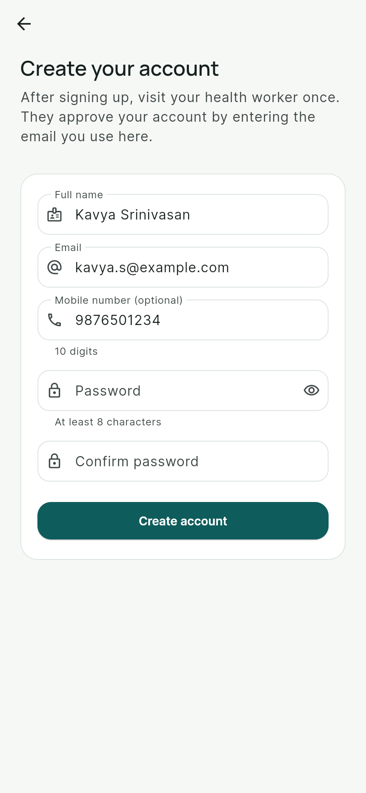

Self sign-up with full name, email, an optional mobile number and a password (entered twice). After signing up, the patient visits their health worker once to be approved (see 2.7).

### 3.3 Waiting for approval

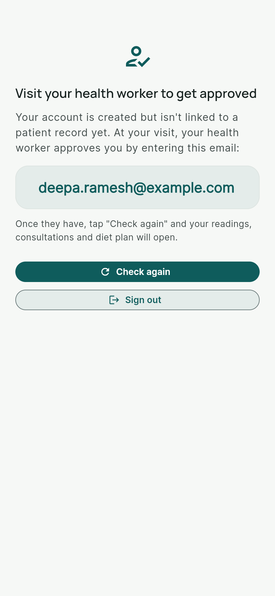

Shown after sign-up until a health worker links the account to a patient record. It shows the email the health worker must enter. **Check again** re-checks the link and **Sign out** leaves.

### 3.4 First sign-in: details and new password

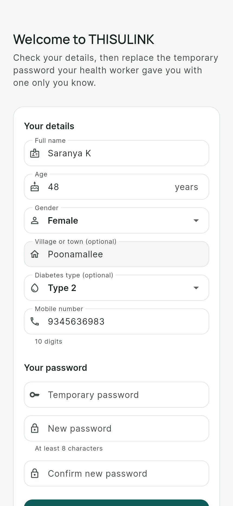
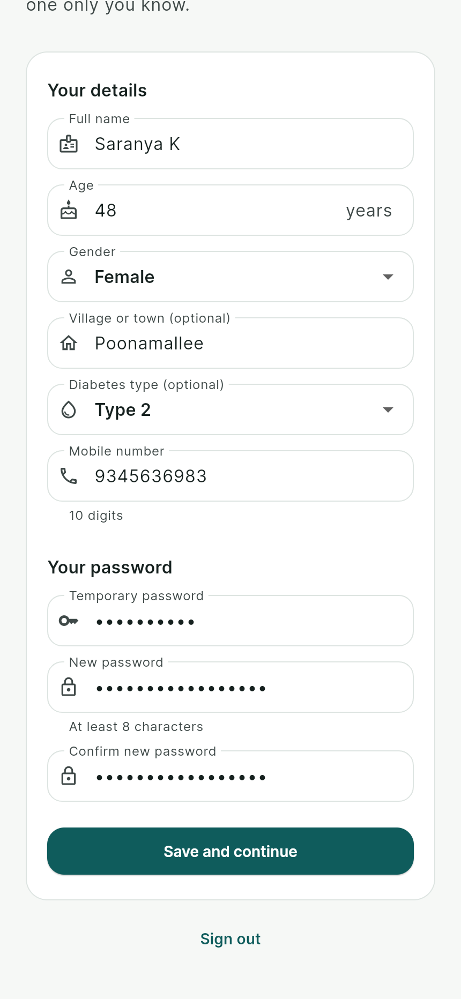

Shown the first time a patient signs in with a temporary password from their health worker.

- **Your details.** Full name, age, gender, village or town, diabetes type and mobile number, pre-filled from the patient record so the patient can correct them.
- **Your password.** The temporary password, then a new password entered twice.
- **Save and continue** opens the app.

### 3.5 Home

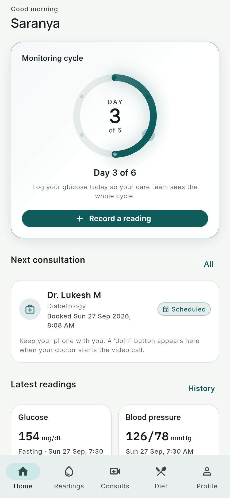
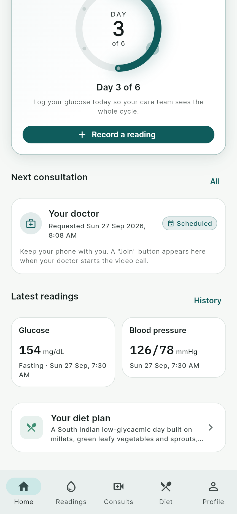

- **Monitoring cycle.** A ring showing the day of the 6-day cycle, a reminder to log glucose today, and **Record a reading**.
- **Next consultation.** The upcoming consultation: the doctor's name and specialisation (e.g. *Dr. Lukesh M, Diabetology*), when it was booked, and its status (*Scheduled*, or *Doctor is ready* with a **Join** button once the doctor starts the call). **All** opens the Consults tab.
- **Latest readings.** The latest glucose and BP. **History** opens the Readings tab.
- **Your diet plan.** A preview of the current AI diet plan. Tapping it opens the Diet tab.
- **Bottom navigation.** Home, Readings, Consults, Diet and Profile.

### 3.6 Readings and trends

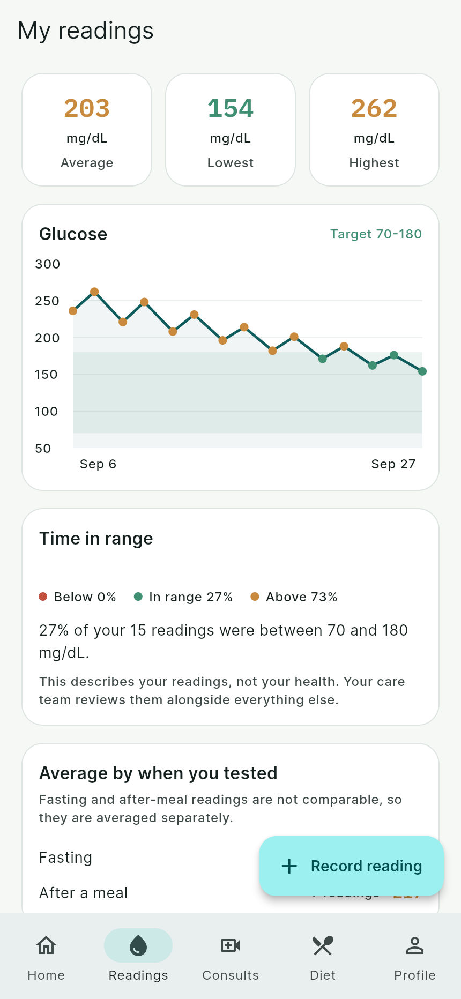
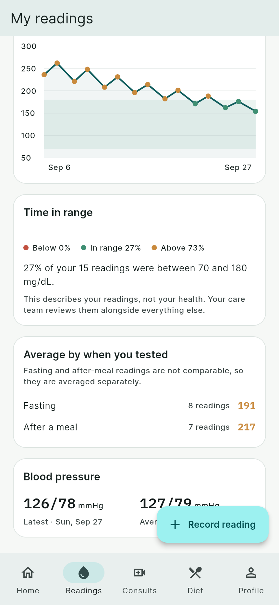
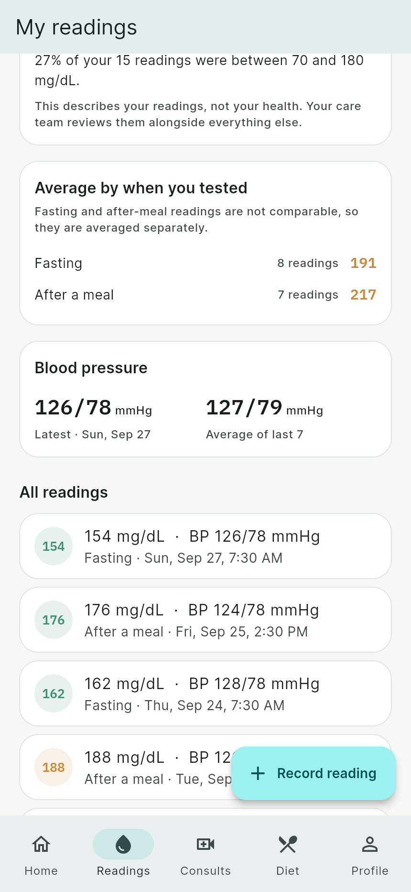

- **Average, lowest and highest** glucose.
- **Glucose chart** with the 70–180 mg/dL target band. Points above the target are orange. The y-axis is labelled in even steps, and the time axis shows the first and last reading dates.
- **Time in range.** The percentage of readings below, within and above range, described in plain words.
- **Average by when you tested.** Fasting and after-meal readings are averaged separately.
- **Blood pressure.** The latest reading and the average of the last 7.
- **All readings.** A list of every entry. An entry recorded offline shows as *Waiting to upload* until it syncs.
- **Record reading** (floating button).

### 3.7 Record a reading

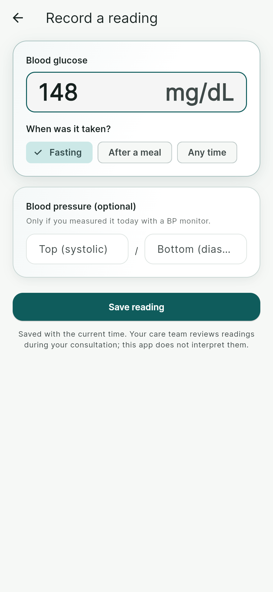

- **Blood glucose** in mg/dL.
- **When was it taken?** *Fasting*, *After a meal* or *Any time*.
- **Blood pressure (optional).** Top (systolic) and bottom (diastolic).
- **Save reading.** Saved with the current time. The app does not interpret the reading; the care team reviews it at the consultation.

### 3.8 Consultations

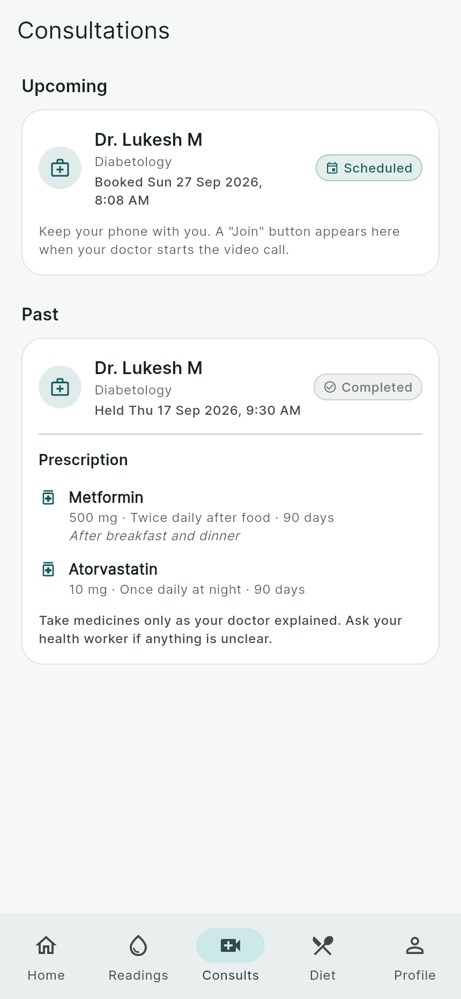

Each card shows the doctor's name and specialisation, and a date that says which date it is: *Booked* (when the consultation was booked; there is no appointment time), *Started* (a call in progress), or *Held* (when a completed call took place).

- **Upcoming.** Scheduled consultations. A **Join** button appears when the doctor starts the video call.
- **Past.** Completed consultations, with the date held and the doctor's **prescription** (drug, dose, frequency, duration and notes).

### 3.9 Diet plan

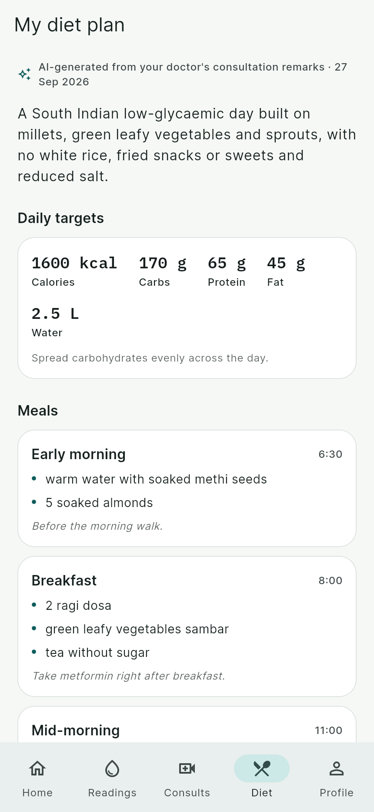
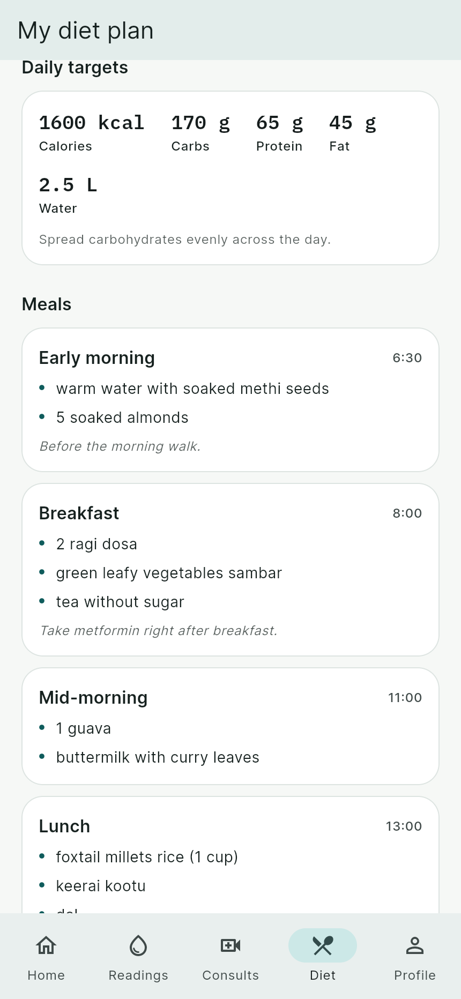
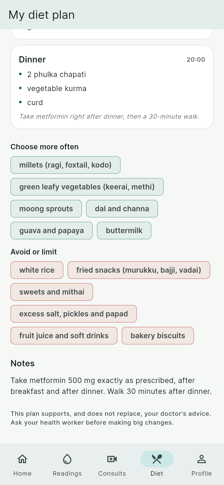

The AI plan generated from the doctor's consultation remarks, with the date it was made.

- **Summary** and **Daily targets** (calories, carbohydrate, protein, fat, water).
- **Meals.** Each meal with its time, items and a short note, such as when to take a medicine.
- **Choose more often** and **Avoid or limit** food chips, then **Notes**.
- A footer reminds the patient that the plan supports, and does not replace, the doctor's advice.

### 3.10 Profile

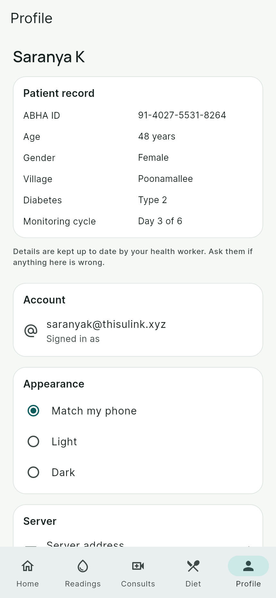

- **Patient record.** ABHA ID, age, gender, village, diabetes type and cycle day. It is read-only and kept up to date by the health worker.
- **Account.** The email or mobile number the patient signed in with.
- **Appearance.** Match my phone, Light or Dark.
- **Server.** The server address, which can be changed for a local-network server.
- **Sign out.**
