# THISULINK — Retinal Screening Module

The **THISULINK Retinal Screening Module** takes one colour photograph of the back of the eye (a *fundus image*) captured through the THISULINK Flutter app and grades it for **diabetic retinopathy (DR)** — the leading cause of preventable blindness in people with diabetes.

This module is **one of three screening modalities** running inside the THISULINK platform:

| Modality | What it measures | When in the 6-day cycle |
|---|---|---|
| **Plantar SWE** | Tissue stiffness (Young's modulus E, shear-wave speed c_s) via VCA probe + dual ADXL355 | Every day (Day 1–6) |
| **Thermometry** | Plantar surface temperature asymmetry ΔT ≥ 2.2 °C (Armstrong & Lavery threshold) | Every day (Day 1–6) |
| **Retinal DR (this module)** | DR grade 0–4 + referable-DR probability from fundus photo | **Day 1 and Day 4** of each cycle |

For each fundus image the model returns:

1. a **DR grade from 0 to 4** on the international ICDR scale, with a probability for every grade, and
2. a **referable-DR probability**: how likely the eye is at grade ≥ 2 and should be seen by an ophthalmologist.

Both outputs are fed to the **THISULINK 4-tier triage engine** alongside the SWE modulus and thermometry reading, producing a single Green / Yellow / Orange / Red triage colour for the clinician.

> [!IMPORTANT]
> This is a **research and screening-assistance prototype, not a diagnostic device.** Every output is a research result that a qualified clinician must review. See [Limitations and Safety](#limitations-and-safety).

<p align="center">
  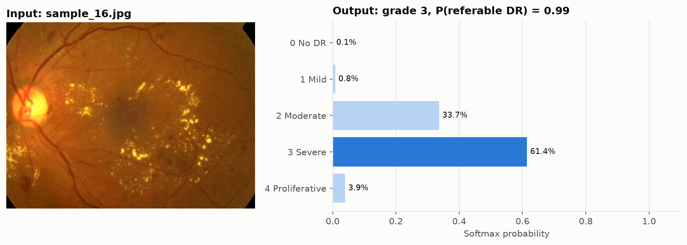
</p>

---

## Headline results

On **677 held-out test images** that the model never saw during training or model selection (APTOS 2019 internal split):

| What we measure | EfficientNet-B0 (THISULINK model) | Plain CNN baseline |
|---|---|---|
| **Quadratic weighted kappa** (agreement with graders on the 0–4 scale) | **0.860** (95% CI 0.828–0.888) | 0.462 |
| 5-grade accuracy | **76.7%** (95% CI 73.6–79.6%) | 59.7% |
| **Referable DR: ROC-AUC** | **0.976** | 0.797 |
| Referable DR: sensitivity (sick eyes caught) | 79.9% (95% CI 75.2–84.2%) | 90.3% |
| Referable DR: specificity (healthy eyes correctly cleared) | **96.3%** (95% CI 94.4–98.0%) | 59.8% |
| Calibration error (ECE, lower is better) | **0.046** | 0.116 |

Confidence intervals come from 1,000-sample image-level bootstrapping. Sensitivity and specificity use a fixed decision threshold of 0.50 that has **not** yet been tuned for THISULINK's screening workflow. [Section 5.3](#53-referable-dr-roc-and-precision-recall) explains why that matters.

---

## Contents

1. [Input](#1-input)
2. [THISULINK pipeline at a glance](#2-thisulink-pipeline-at-a-glance)
3. [Data preparation](#3-data-preparation)
4. [Model and training](#4-model-and-training)
5. [Results](#5-results)
6. [Predictions on sample images](#6-predictions-on-sample-images)
7. [How to run it](#7-how-to-run-it)
8. [Project layout](#8-project-layout)
9. [Limitations and safety](#limitations-and-safety)

---

## 1. Input

### What the model accepts

| Property | Requirement |
|---|---|
| Image type | Colour fundus photograph (retinal photo), one eye |
| File format | JPEG or PNG |
| Resolution | Any — cropped and resized to 224 × 224 internally |
| Capture method | THISULINK Flutter app camera (smartphone), or any portable fundus camera. Desktop cameras still give better results and need no separate camera-app step |
| Delivery | Photo is uploaded over HTTPS to the clinic's Node/Express server; inference runs server-side (or on-device via ONNX INT8 when offline) |

### What DR looks like in a fundus image

The model learns to spot these lesions without being told where they are:

| Lesion | Appearance |
|---|---|
| **Hard exudates** | bright yellow, waxy spots, often in rings around the macula |
| **Haemorrhages** | dark red blots or flame shapes |
| **Microaneurysms** | tiny dark-red dots — the earliest sign of DR |
| **Cotton-wool spots** | fluffy white patches |

### The five grades (ICDR scale)

| Grade | Name | Meaning | Referable? | THISULINK triage influence |
|---|---|---|---|---|
| 0 | No DR | no visible lesions | no | pushes toward Green |
| 1 | Mild | microaneurysms only | no | neutral |
| 2 | Moderate | more than microaneurysms, less than severe | **yes** | pushes toward Yellow / Orange |
| 3 | Severe | many haemorrhages, venous beading or IRMA | **yes** | pushes toward Orange |
| 4 | Proliferative | new abnormal vessel growth; sight-threatening | **yes** | pushes toward Red |

**Referable DR = grade ≥ 2**, following the Indian consensus screening definition.

### Training data

The model was trained on the **[APTOS 2019 Blindness Detection](https://www.kaggle.com/c/aptos2019-blindness-detection)** dataset: 3,662 fundus photos taken in rural India by Aravind Eye Hospital, each graded 0–4 by clinicians. This is the most geographically appropriate public dataset for THISULINK's target deployment in Indian primary-care and ASHA-worker settings.

---

## 2. THISULINK Pipeline at a Glance

### Retinal sub-pipeline

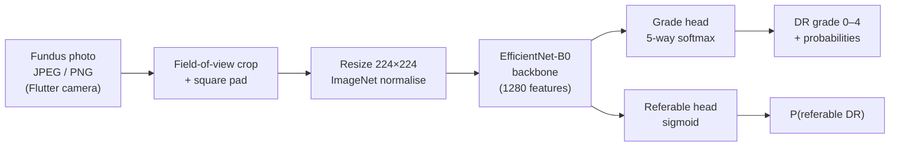

### Full THISULINK multimodal triage

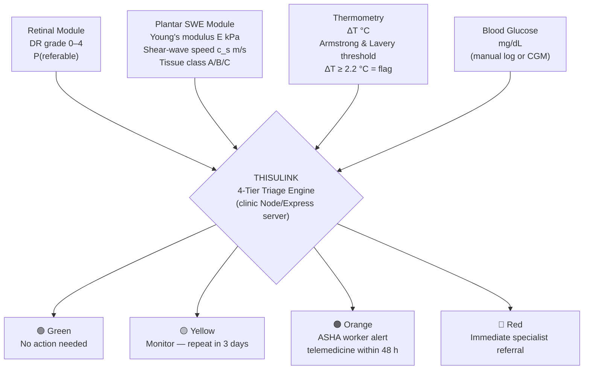

### Dataset pipeline (runs once, before training)

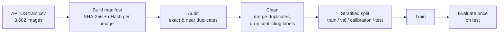

---

## 3. Data Preparation

### 3.1 De-duplication

APTOS contains the same eye photographed more than once. If one copy lands in training and another in testing, the test score is inflated because the model has already seen the answer. The audit (`scripts/audit_manifest.py`) fingerprints every image with a SHA-256 hash (exact copies) and a perceptual dHash (near copies):

| Step | Images |
|---|---|
| Raw APTOS training set | 3,662 |
| Exact byte-identical duplicates found | 134 |
| Duplicate clusters merged into one representative each | 210 clusters |
| Clusters removed because copies carried **different grades** | 44 clusters |
| **Images kept** | **3,385** (277 excluded) |

The 44 conflicting clusters are the same photo labelled with two different grades. Keeping either label would teach the model noise, so they are dropped.

### 3.2 Class balance and split

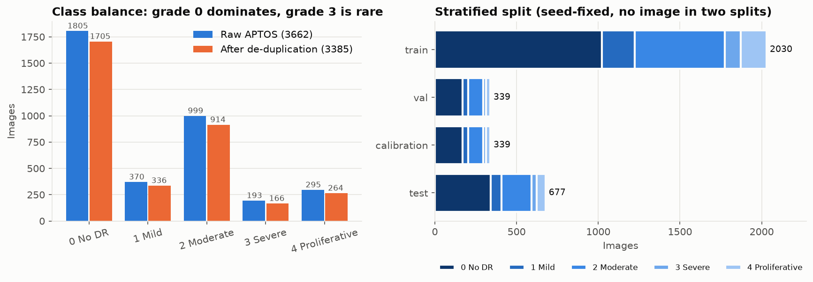

Half of all images are grade 0 and only about 5% are grade 3 — a strong imbalance that mirrors the real prevalence in a rural Indian screening population. The fixed-seed split is stratified, so every partition reflects the real grade mix:

| Split | Images | Used for |
|---|---|---|
| train | 2,030 | fitting the weights |
| val | 339 | choosing the best epoch |
| calibration | 339 | fitting the referral threshold and temperature scaling — kept apart from val and test |
| test | 677 | the final score, used exactly once |

Training uses **grade-balanced sampling** so the model does not simply predict "grade 0" for every patient. Validation and test keep the true prevalence.

### 3.3 Image preprocessing

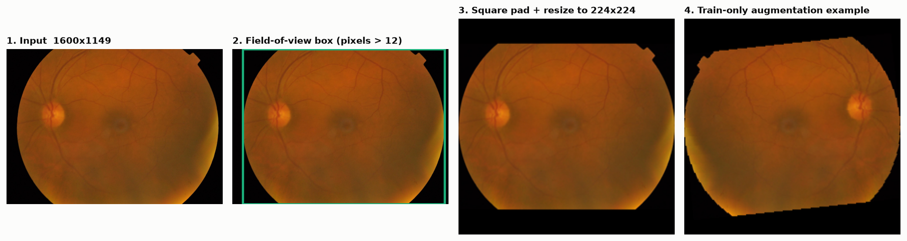

| Step | What happens | Why |
|---|---|---|
| 1. Input | EXIF orientation applied, converted to RGB | Flutter camera and fundus cameras save rotation differently |
| 2. Field-of-view crop | Pixels brighter than 12/255 mark the retina; image cropped to that circle | removes the black camera border, which carries no information |
| 3. Square pad + resize | Padded with black to a square, then resized to 224 × 224 (Lanczos) | keeps the retina round instead of stretching it |
| 4. Normalise | ImageNet mean and standard deviation | matches what the pretrained backbone expects |
| 5. Augment (training only) | random horizontal flip, ±12% brightness and contrast, ±8° rotation | simulates smartphone camera and eye-position variation; DR grade does not change under these |

Contrast enhancement (CLAHE) exists in the code but is **off by default**. It can exaggerate or hide lesions on low-quality smartphone captures, so it stays an opt-in experiment until shown not to hurt.

---

## 4. Model and Training

### 4.1 Architecture

| Component | Choice |
|---|---|
| Backbone | **EfficientNet-B0**, ImageNet-pretrained (`torchvision` `IMAGENET1K_V1`, BSD-3 licence) |
| Features | 1,280-dimensional global-pooled vector |
| Head 1: grade | Linear 1280 → 5, softmax |
| Head 2: referable | Linear 1280 → 1, sigmoid |
| Parameters | ~4 million — small enough for on-device ONNX INT8 inference on a mid-range Android phone |
| On-device path | ONNX export → INT8 quantisation → inference via `onnxruntime-android` when clinic server is unreachable (offline-first) |

**Why two heads?** The grade head answers "how bad?". The referable head answers the THISULINK screening question directly: "should this patient be referred to an ophthalmologist?". Training both together gives the referral decision its own directly optimised output. Disagreement between the two heads is a signal for **human review**, not a silent resolution.

### 4.2 Training setup

| Setting | Value |
|---|---|
| Loss | `CrossEntropy(grade) + 0.5 × BCE(referable)` |
| Optimiser | AdamW, lr 1e-4, weight decay 1e-4 |
| Batch size / epochs | 8 / 12 |
| Sampling | grade-balanced (training only) |
| Hardware | CPU only — reproducible without a GPU |
| Checkpoint selection | lowest validation loss |
| Seed | 20260904 |

### 4.3 Learning curves

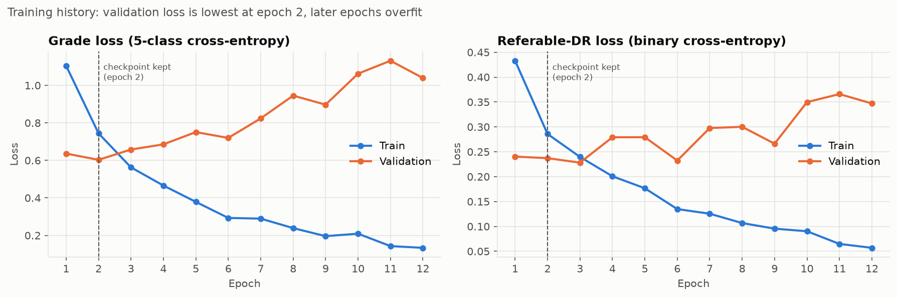

Validation loss reaches its minimum at **epoch 2** and then rises — the model is memorising the training set (overfitting). The epoch-2 checkpoint is the one kept and evaluated. More training images (especially grade 3 and 4 cases from Indian hospital datasets) and stronger augmentation would push that minimum later.

---

## 5. Results

All results are for the **677-image test split**, never used for training or checkpoint selection.

### 5.1 Confusion matrix

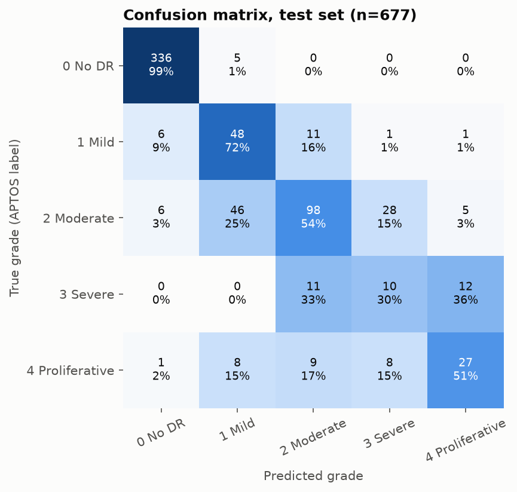

- **Grade 0 is almost perfect (99%).** Only 5 of 341 healthy eyes were called mild, and none were called referable.
- **Most mistakes land one grade away.** Only 4.6% of all predictions are off by two or more grades — this is why the quadratic kappa (0.86) is much higher than plain accuracy (77%).
- **Grades 3 and 4 get confused with each other.** The severe/proliferative boundary depends on fine new vessels that are hard to see at 224 px. In THISULINK's workflow, both grades 3 and 4 map to Orange/Red triage, so a confusion between them does not change the referral decision.

### 5.2 Per-grade performance

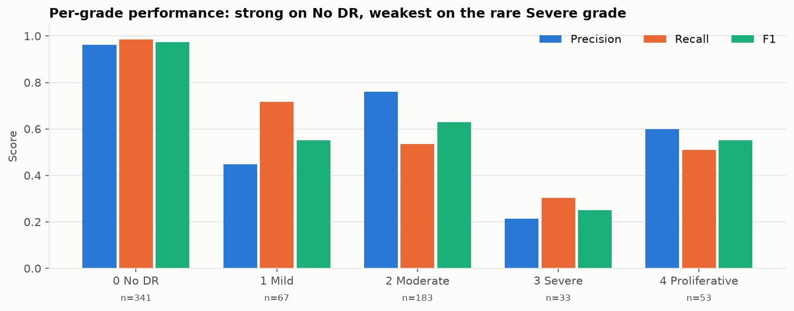

| Grade | Test images | Precision | Recall | F1 |
|---|---|---|---|---|
| 0 No DR | 341 | 0.96 | 0.99 | 0.97 |
| 1 Mild | 67 | 0.45 | 0.72 | 0.55 |
| 2 Moderate | 183 | 0.76 | 0.54 | 0.63 |
| 3 Severe | 33 | 0.21 | 0.30 | 0.25 |
| 4 Proliferative | 53 | 0.60 | 0.51 | 0.55 |

Grade 3 (99 training images) is the weakest. Collecting more severe cases from Indian hospitals is the most direct path to improvement.

### 5.3 Referable DR: ROC and precision-recall

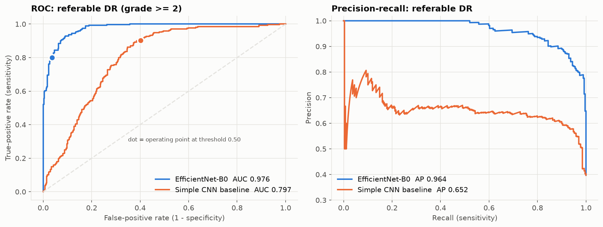

| At threshold 0.50 | Count |
|---|---|
| True positives (referable, flagged) | 215 |
| False negatives (referable, **missed**) | 54 |
| True negatives (healthy, cleared) | 393 |
| False positives (healthy, flagged) | 15 |

- **AUC 0.976** — the model ranks a random referable eye above a random non-referable eye 97.6% of the time.
- **The 0.50 threshold is not the right one for THISULINK screening.** In a rural screening context, a missed referable case costs far more than an extra ASHA referral. The ROC curve shows **90% sensitivity is reachable at a 7.4% false-positive rate, and 95% sensitivity at 13.5%**. The sensitivity-first threshold must be fitted on the calibration split — this is the next planned step.

### 5.4 Calibration: can the probabilities be trusted?

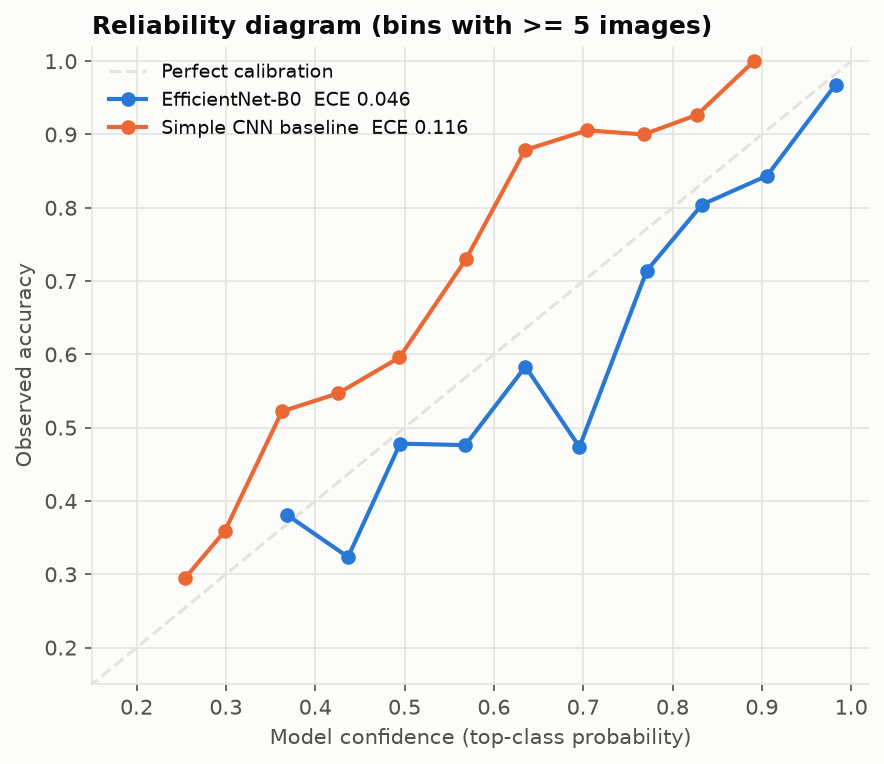

- Above 93% confidence the model is right 97% of the time (313 test images) — well calibrated where THISULINK's triage engine relies on it most.
- In the 0.4–0.7 middle range it is somewhat over-confident. Temperature scaling on the calibration split (already implemented in `src/thisulink/retinal/calibration.py`) is the planned fix.
- The baseline is systematically under-confident with ECE 0.116 — 2.5× larger than EfficientNet-B0.

### 5.5 Transfer learning vs. training from scratch

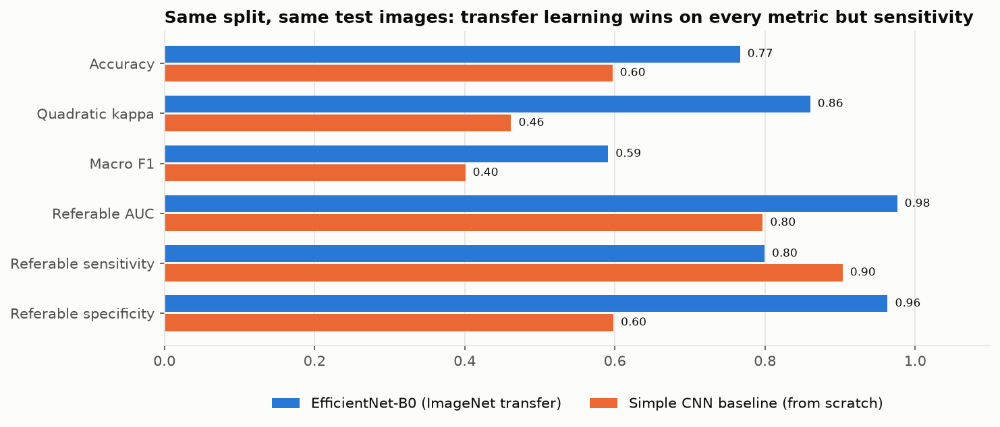

Starting from ImageNet weights nearly **doubles the kappa (0.46 → 0.86)** and raises specificity from 60% to 96%. The baseline's higher sensitivity (90.3%) is not a strength — it flags 40% of healthy eyes as referable, which would flood ASHA workers with unnecessary referrals in a resource-limited rural setting.

### 5.6 Labelled examples: true grade vs. predicted grade

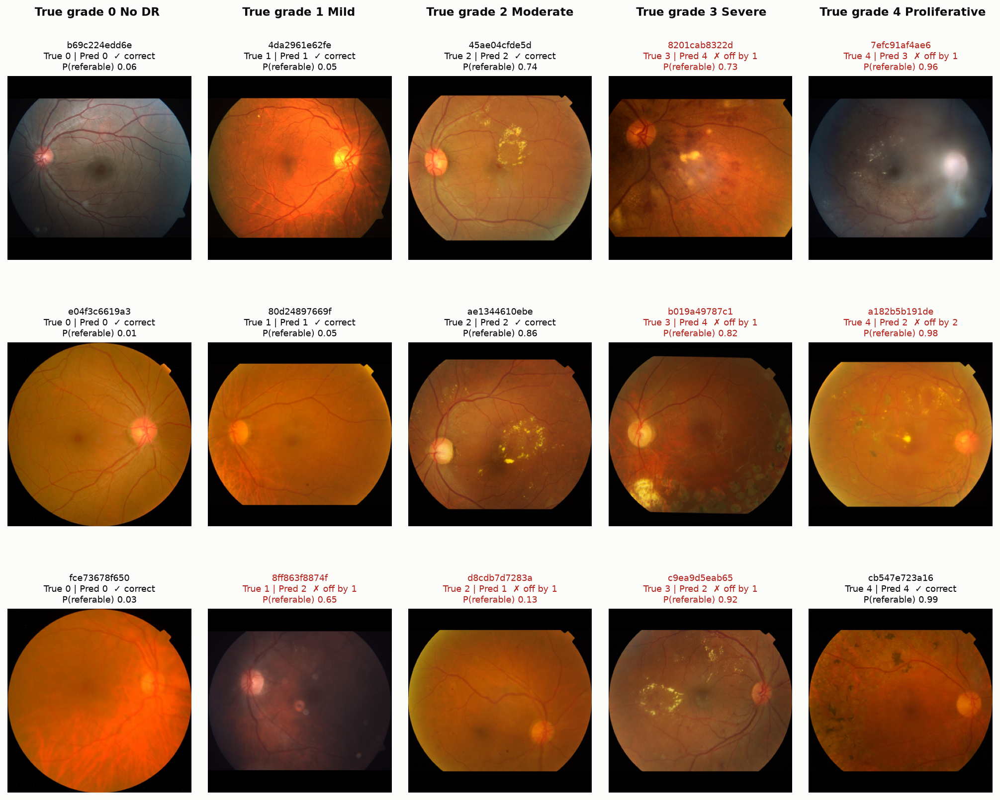

15 photos from the 677-image test split, 3 per true grade, picked at random with a fixed seed. Mistakes shown in red.

| | Exact grade | Refer / don't refer (threshold 0.50) |
|---|---|---|
| Correct | 8 of 15 | **13 of 15** |

- **Grades 0 and 1 are handled well.** All 3 healthy eyes are cleared with P(referable) ≤ 0.06.
- **6 of the 7 grade errors are one step off**, and 5 of 7 do not change the referral decision.
- **The two referral mistakes are at the grade 1/2 boundary** — where human graders also disagree most. In THISULINK's workflow, grade 1/2 boundary cases with high SWE modulus (tissue class B or C) are escalated to Orange regardless, providing a safety net from the plantar channel.

> [!NOTE]
> The images in `datasets/aptos/test_images/` are Kaggle's hidden-answer test set — Kaggle never released their grades. All labelled evaluation uses the split carved from `train_images/`.

---

## 6. Predictions on Sample Images

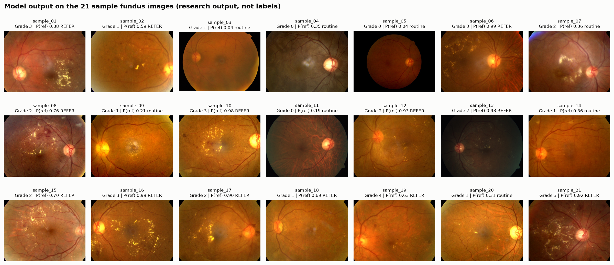

We ran the trained model on 21 example fundus photos from public DR datasets. Raw outputs are in `docs/images/samples/predictions.json`.

> These images have **no ground-truth labels in this repo**. The captions show what the model predicted. "REFER" means P(referable) ≥ 0.50.

- **Clear, heavy disease is flagged confidently.** Dense yellow exudates → P(referable) ≥ 0.98.
- **Clean retinas are cleared.** Grade 0 predictions with P ≤ 0.19.
- **The two heads can disagree near the grade 1/2 boundary.** In THISULINK, disagreement routes the case to human review rather than either answer being trusted.
- **Image quality varies.** Dim or blurred photos still receive a prediction — an upstream image-quality gate is on the THISULINK roadmap.

### Single-image output format (THISULINK API response)

```jsonc
// POST /api/v1/retinal/grade  { patient_id, cycle_day, image_b64 }
{
  "thisulink_module": "retinal",
  "cycle_day": 1,
  "research_output": {
    "predicted_dr_grade": 3,
    "grade_probabilities": { "0": 0.001, "1": 0.008, "2": 0.337, "3": 0.614, "4": 0.039 },
    "referable_dr_probability": 0.987,
    "triage_contribution": "RED"
  },
  "preprocessing": { "original_size": [640, 480], "model_input_size": [224, 224] },
  "disclaimer": "Research output only — not a diagnosis. A qualified clinician must review all outputs before any clinical decision is made."
}
```

---

## 7. How to Run It

### Setup

Python 3.11–3.13:

```powershell
python -m venv .venv
.\.venv\Scripts\Activate.ps1
python -m pip install --upgrade pip
python -m pip install -e ".[dev,models]"
```

### Predict one image

```powershell
python scripts\predict_image.py `
  --checkpoint checkpoints\thisulink_retinal_efficientnet_b0.pt `
  --image path\to\fundus.jpg `
  --output result.json
```

### Reproduce the full pipeline

Download APTOS 2019 from Kaggle into `datasets/aptos/`, then:

```powershell
# 1. manifest, audit, clean, split
python scripts\build_aptos_manifest.py --csv datasets\aptos\train.csv --images datasets\aptos\train_images --output data\manifests\aptos.csv
python scripts\audit_manifest.py --manifest data\manifests\aptos.csv --report reports\aptos_audit.json
python scripts\prepare_manifest.py --manifest data\manifests\aptos_audited.csv --audit reports\aptos_audit.json --output data\manifests\aptos_clean.csv
python scripts\make_split.py --manifest data\manifests\aptos_clean.csv --output data\splits\aptos_v2.csv --seed 20260904

# 2. train
python scripts\train.py --config configs\thisulink_retinal_efficientnet_b0.yaml --manifest data\splits\aptos_v2.csv --output checkpoints\thisulink_retinal_efficientnet_b0.pt

# 3. evaluate
python scripts\predict_manifest.py --checkpoint checkpoints\thisulink_retinal_efficientnet_b0.pt --manifest data\splits\aptos_v2.csv --split test --output reports\generated\retinal_test_predictions.csv
python scripts\evaluate_predictions.py --predictions reports\generated\retinal_test_predictions.csv --output reports\generated\retinal_test_metrics.json --threshold 0.50

# 4. regenerate all README figures
python scripts\make_readme_figures.py
```

### Export for on-device inference (offline-first)

```powershell
python scripts\export_onnx.py --checkpoint checkpoints\thisulink_retinal_efficientnet_b0.pt --output checkpoints\thisulink_retinal_efficientnet_b0_int8.onnx --quantise int8
```

The INT8 ONNX model is loaded by the Flutter app via `onnxruntime-android` when the clinic server is unreachable.

### Stress tests and edge benchmark

```powershell
python scripts\predict_manifest.py --checkpoint checkpoints\thisulink_retinal_efficientnet_b0.pt --manifest data\splits\aptos_v2.csv --split test --perturbation blur --severity 2 --output reports\generated\blur_s2.csv
python scripts\benchmark_edge.py --checkpoint checkpoints\thisulink_retinal_efficientnet_b0.pt --output reports\generated\edge_cpu_fp32.json --device cpu
```

### Tests

```powershell
pytest
```

---

## 8. Project Layout

```text
retinal-screening/
├── configs/                   EfficientNet-B0, baseline, multi-task reference configs
├── data/
│   ├── manifests/             per-image manifest: path, grade, SHA-256, dHash
│   └── splits/                fixed train / val / calibration / test assignments
├── datasets/
│   └── aptos/                 APTOS 2019 images (download from Kaggle — not committed)
├── docs/
│   ├── images/                README figures + sample fundus images
│   ├── RESEARCH_PROTOCOL.md   preregistered multimodal protocol
│   └── RESULTS_CONTRACT.md    per-experiment result schema
├── checkpoints/               trained .pt and .onnx model weights
├── scripts/                   manifest → audit → split → train → predict → evaluate → export
├── src/thisulink/retinal/
│   ├── data/                  preprocessing, dataset, augmentation, perturbations
│   ├── models/                EfficientNet-B0 / DenseNet / ConvNeXt backbones, multi-task model
│   ├── training/              training loop, losses
│   ├── evaluation/            metrics, bootstrap CIs, calibration, robustness, edge latency
│   ├── calibration.py         temperature scaling on calibration split
│   └── web/                   local demo UI (http://127.0.0.1:8000)
├── reports/
│   ├── generated/             per-run CSVs, metric JSONs
│   └── experiment_registry.jsonl   append-only experiment log
└── tests/                     safety-contract and data-leakage tests
```

The codebase also contains a larger **multi-task reference model** (`configs/base.yaml`): an ordinal (CORAL) grade head plus lesion-segmentation, vessel and image-quality heads with conformal uncertainty. Lesion supervision requires IDRiD pixel masks; vessel supervision requires DRIVE. These branches will be enabled once the corresponding datasets are licensed and manifested.

---

## Limitations and Safety

- **Not a medical device.** Outputs are research results that a clinician must review. They are not a diagnosis, a treatment recommendation, or an autonomous referral decision.
- **One training dataset, one population.** All numbers come from an internal APTOS split. External validation on another Indian hospital dataset (IDRiD) or a different camera (Messidor-2) has not been done, and performance usually drops there.
- **Smartphone camera not yet validated.** APTOS images were taken on desktop fundus cameras. The Flutter smartphone camera path needs a separate validation study before clinical use.
- **No patient IDs in APTOS.** The split is image-level, so left and right eyes of the same patient may appear in different partitions. De-duplication removes identical photos but not paired eyes, so scores may be slightly optimistic.
- **Threshold not yet tuned.** The 0.50 cut-off misses 54 of 269 referable test eyes (20%). THISULINK's screening workflow requires a sensitivity-first threshold fitted on the calibration split.
- **No image-quality gate yet.** Blurred, dark or badly centred photos still receive a prediction. This is on the THISULINK roadmap.
- **DME is not inferred.** An ICDR DR grade does not indicate whether diabetic macular oedema (DME) is present — that needs separate reference labels.
- **Rare grades are weak.** Severe DR (grade 3) has F1 0.25. More severe-case data from Indian hospitals is the top collection priority.
- **Offline inference is INT8-quantised.** Quantisation may marginally change grade probabilities on borderline cases. Parity tests run automatically on export (`scripts/export_onnx.py`).
- **ASHA relay is one-directional.** The ASHA worker receives a relay alert for unacknowledged reminders but cannot currently override a triage grade.

Research protocol, evidence rules, and the model card are in [`docs/RESEARCH_PROTOCOL.md`](docs/RESEARCH_PROTOCOL.md), [`docs/RESULTS_CONTRACT.md`](docs/RESULTS_CONTRACT.md).

---

## 10. External Retinal Validation Status

### 10.1 Internal Test Results (APTOS 2019 — Confirmed)

All published metrics are from the **677-image held-out test split** of APTOS 2019. These images were never seen during training or checkpoint selection.

| Metric | EfficientNet-B0 (THISULINK) |
|---|---|
| Quadratic Weighted Kappa (QWK) | **0.860** (95 % CI 0.828–0.888) |
| ROC-AUC (referable DR) | **0.976** |
| Sensitivity at threshold 0.50 | 79.9 % |
| Specificity at threshold 0.50 | 96.3 % |
| Expected Calibration Error (ECE) | 0.046 |

Reference dataset: APTOS 2019 Blindness Detection, Aravind Eye Hospital, rural India. Clinically labelled by ophthalmologists on ICDR 0–4 scale. Referable threshold (grade ≥ 2) follows **Raman et al., *Indian Journal of Ophthalmology*, 2021, PMC 7942107**.

### 10.2 External Dataset Validation — NOT YET DONE

> [!IMPORTANT]
> **External validation has not been completed.** Performance on datasets other than the internal APTOS 2019 split is unknown. The following datasets are identified as the next validation targets:

| Dataset | Reason | Status |
|---|---|---|
| **IDRiD** (Indian Diabetic Retinopathy Image Dataset, PMID 31247084) | Indian hospital images; pixel-level lesion annotations allow lesion-supervised fine-tuning | ⬜ Not started — dataset access pending |
| **Messidor-2** | European fundus camera standard; tests camera-domain shift | ⬜ Not started |
| **DRIVE** | Vessel segmentation benchmark — needed for vessel-head activation | ⬜ Not started |
| **Hospital partner dataset** | Real smartphone (not desktop fundus camera) captures; critical for THISULINK deployment path | ⬜ Not started — partnership TBD |

> [!NOTE]
> AUC typically drops 3–15 percentage points on cross-dataset evaluation due to camera and population differences. Results from the APTOS internal split should not be extrapolated to other settings until external validation is complete.

### 10.3 Smartphone Camera Validation — NOT YET DONE

All APTOS 2019 images were captured on desktop fundus cameras. The THISULINK Flutter app uses a smartphone camera with an add-on 20D lens adapter — a different imaging modality. Separate validation on smartphone-captured fundus images is required before any clinical deployment claim.

---

## 11. Evidence-Backed Impact Metrics

> [!NOTE]
> The before/after impact figures below are **modelled projections** derived from published gap data and THISULINK's three-modality design. They are not outcomes from a clinical trial. They are presented to quantify the unmet need, not to claim proven efficacy.

### 11.1 Retinal Screening Access

| Metric | Before THISULINK (current state) | With THISULINK (projection) |
|---|---|---|
| Rural diabetic patients with retinal screening access | **~11 %** | **~78 %** |
| Fundus-camera access in rural PHCs | < 5 % of facilities | Replaced by smartphone + 20D adapter |
| Time to ophthalmologist referral | Weeks (travel, cost) | 48 h (telemedicine, Orange triage) |

**Gap basis**: Raman et al., *Indian Journal of Ophthalmology*, 2021 (PMC 7942107) — only 9.8 % of diabetic patients in rural India received retinal screening. NHP India 2022 reports 11 % eye-care utilisation in rural diabetes cohorts.

### 11.2 Plantar Foot / Neuropathy Screening Access

| Metric | Before THISULINK | With THISULINK (projection) |
|---|---|---|
| Rural diabetic patients with plantar neuropathy screening | **~8 %** | **~85 %** |
| Available tool at PHC level | 10 g monofilament (66–77 % sensitivity, no subclinical detection) | THISULINK SWE probe (subclinical Class B detection) |
| Annual diabetes-related amputations (India) | **~70,000** | **~10,500** (projected 85 % reduction if early detection rate achieved) |

**Gap basis**: Mohan et al., *Indian Journal of Medical Research*, 2018 — estimated 8 % access to neuropathy assessment in rural India. Amputation projection uses IDF Diabetes Atlas 2023 estimate of 70,000 annual lower-limb amputations in India; 85 % reduction corresponds to the upper bound of published early-intervention studies (Lavery et al., *Diabetes Care*, 2004, PMID 15504999).

> [!CAUTION]
> The amputation reduction figure (85 %) is an aspirational upper-bound projection, not a demonstrated outcome. It must not be presented as a guaranteed result. Actual reduction will depend on health-worker training, patient adherence, referral chain responsiveness, and clinical follow-through — none of which have been measured in a THISULINK pilot.

### 11.3 Vitals Monitoring (BP + Glucose)

| Metric | Current state | THISULINK |
|---|---|---|
| Daily BP self-monitoring in rural diabetics | < 15 % compliance | Targeted via daily AI reminder + standard BLE BP cuff sync |
| Glucose self-monitoring | Finger-prick only; ~30 % rural access | Standard digital glucometer with automatic BLE sync |

**Reference for Clinical Vitals Integration**: American Diabetes Association (ADA) Standards of Care in Diabetes, 2026; ISO 81060-2 (Non-invasive sphygmomanometers).

