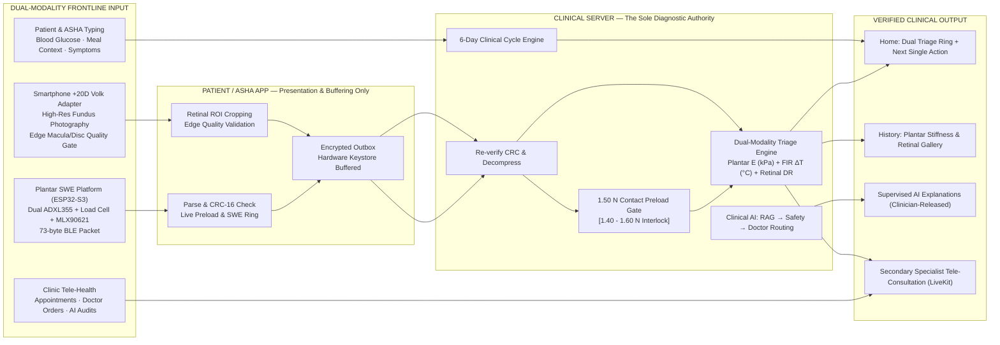
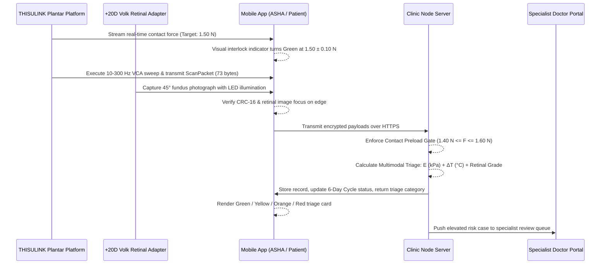
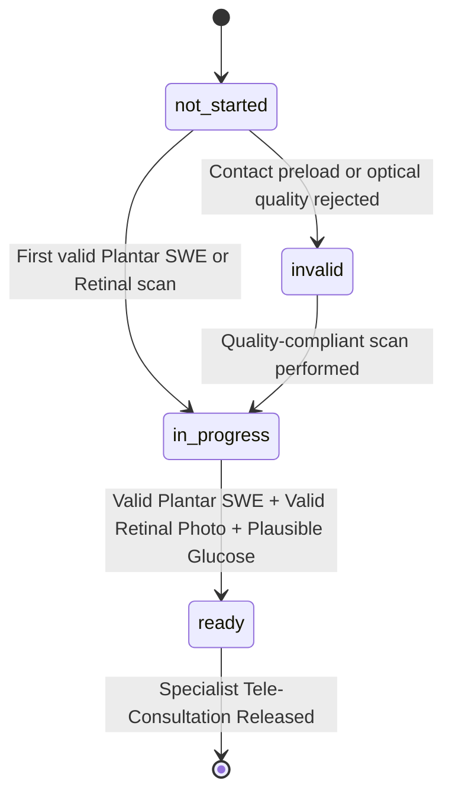
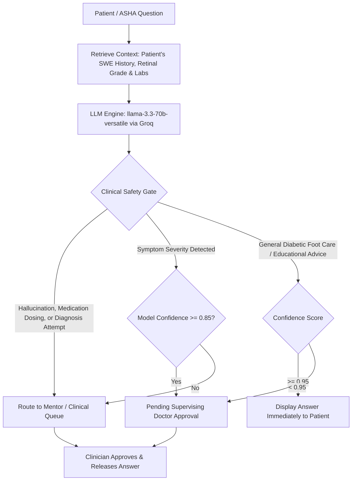

# THISULINK — Frontline Dual-Modality Triage & Patient Companion App

A cross-platform Flutter application engineered for frontline healthcare workers (ASHAs) and people living with diabetes. It interfaces seamlessly with the **THISULINK Plantar Biomechanical SWE Platform** over Bluetooth Low Energy (BLE) and the **Smartphone +20D Volk Retinal Adapter**, collects a structured 6-day cycle of biomechanical, thermal, optical, and glycemic measurements, and hands validated diagnostic records to supervising clinicians. 

Everything clinical is authenticated and decided on the clinic's own server; the mobile handset acts as an instrument panel, telemetry display, and encrypted edge relay—never an unchecked authority.

| Specification | Implementation Details |
|---|---|
| **Platform** | Flutter 3.19+ / Dart 3.3+ — Android & iOS (BLE & Camera), Web & Desktop (Clinician Portal) |
| **State / Routing** | Riverpod 2, go_router 14 |
| **Backend** | Single clinic-controlled Node/Express service reached over secure HTTPS |
| **Database** | Embedded PocketBase (127.0.0.1:8090) shielded behind strict server policy layers |
| **Visualization** | `fl_chart` (Longitudinal Plantar Modulus $E$, Thermal Asymmetry $\Delta T$, and Glycemic Trends) |
| **Teleconsultation** | LiveKit (`livekit_client`) — End-to-end encrypted rooms with server-issued tokens |
| **Notifications** | `flutter_local_notifications` + Android WorkManager polling (No third-party push clouds / FCM) |
| **Primary Tabs** | Home (Cycle Ring) · Measure (SWE & Retinal) · History (Trends) · Assistant · Profile |

---

## 1. The Dual-Modality Pipeline at a Glance

Four clinical signals enter this system, four verified outputs emerge, and zero unauthenticated diagnostic conclusions are drawn on the mobile device:



> **Core Architectural Rule**: The mobile application uploads raw encrypted bytes and re-reads the server's verdict. The phone parses sensor packets locally *strictly* to provide real-time UI feedback (such as the $1.50\text{ N}$ preload indicator and live waveform ring) and to trap corrupted frames before network dispatch. If client-side parsing ever disagrees with server-side validation, **the server always wins**.

---

## 2. Frontline Input Channels

| Source | Telemetry / Payload | Entry Point |
|---|---|---|
| **Plantar Platform (BLE)** | `ScanPacket` — 73 bytes, little-endian, header `0xDA 0x7A`, CRC-CCITT over `[0, 71)` | `features/ble/platform_ble_service.dart` |
| **Plantar Platform (Live)** | `StatusPacket` — Real-time contact preload ($1.50\text{ N}$ gate) streamed on secondary UUID | `features/scan/live_scan_controller.dart` |
| **Retinal Module (Camera)** | High-resolution fundus image captured through +20D Volk optical adapter | `features/retina/retinal_capture_screen.dart` |
| **Patient / ASHA** | Capillary blood glucose + unit (mg/dL or mmol/L) + meal timing | `features/glucose/glucose_entry_screen.dart` |
| **Patient / ASHA** | Nutritional / meal logs (dietary photo or text entry) | `features/food/food_log_screen.dart` |
| **Patient / ASHA** | Natural language triage inquiries and symptom questions | `features/ai/assistant_screen.dart` |
| **Clinic Server** | Teleconsultation rooms, doctor prescription adjustments, released reports | Polled over HTTPS REST API |

---

### The Plantar Platform BLE Packet Structure

Authoritative protocol definition: `firmware/include/Packet.h`. Independent, matching codecs exist in C++ (ESP32-S3 firmware), TypeScript (Node.js server), and Dart (`features/scan/scan_packet_codec.dart`).

```
Offset   Field                       Description
0        header[2] = 0xDA 0x7A       Magic synchronization bytes
2        protocolVersion             Firmware wire protocol (v2.0)
3        deviceId (u32)              Cryptographic hardware serial number
7..9     firmware major/minor/patch  Active firmware build version
10       timestampUnixSec (u32)      Internal RTC hardware timestamp
14       batteryPercent              Li-ion battery fuel gauge level (%)
15       contactPreloadN (f32)       Micro load-cell static contact force (Target: 1.50 N)
19..38   Biomechanical Features:
           - shearWaveSpeed_mps      Estimated phase velocity cs (m/s) across dx = 40 mm
           - youngsModulus_kPa       Tissue elasticity E = 3 * rho * cs^2 (kPa)
           - resonanceFrequency_Hz   Peak mechanical resonance fn (Hz)
           - dampingRatio_zeta       Viscoelastic damping coefficient
           - dynamicAmplitude_um     Contactor dynamic displacement (safe < 30 um)
39..58   Optical & Thermal Features:
           - redReflectance          Photoplethysmography (PPG) red channel
           - irReflectance           Infrared tissue optical absorption
           - perfusionIndex          Plantar microvascular pulsatile index
           - thermalAsymmetry_degC   MLX90621 16x4 contralateral temperature difference (ΔT)
           - maxPlantarTemp_degC     Peak localized plantar surface temperature
63       ambientTemperatureC         Enclosure thermistor reading (environment reference)
71       crc16                       CRC-CCITT checksum over bytes [0..70]
```

### Offline First & Zero-Trust Buffer (`ScanOutbox`)
In rural field camps lacking cellular connectivity, raw sensor packets are buffered without local interpretation. `ScanOutbox` (`services/local_storage/scan_outbox.dart`) seals the raw 73-byte payloads into the Android Keystore / iOS Keychain (`flutter_secure_storage`). When internet connectivity is restored, packets are uploaded in original sequence with cryptographic chain of custody preserved.

---

## 3. End-to-End Processing & Clinical Governance



### 3.1 Validation Rules Enforced by the Server Authority
| Parameter / Channel | Clinical Validity Range | Operational Rationale |
|---|---|---|
| **Contact Preload Gate** | $1.40\text{ N} - 1.60\text{ N}$ ($1.50\text{ N} \pm 0.10\text{ N}$) | Prevents hyperelastic tissue stiffening artifacts ($> 30\%$ error if unconstrained). |
| **Optical Reflected Floor** | $\ge 0.010$ | Rejects lift-off, ambient light leakage, or non-contact scans. |
| **Capillary Glucose Range** | $20 - 600\text{ mg/dL}$ | Standard physiological meter saturation boundaries. |
| **Glucose Unit Conversion** | $\text{mmol/L} \times 18.0182 = \text{mg/dL}$ | Standardized to 1 decimal place across all database records. |
| **Thermal Differential Bound**| $-5.0^\circ\text{C} \le \Delta T \le +10.0^\circ\text{C}$ | Rejects broken MLX90621 FIR pixel arrays or external heaters. |
| **Backdating Timestamp** | $\le 7\text{ days}$ past | Prevents stale retrospective data corruption. |
| **Clock Skew Threshold** | $\le 5\text{ minutes}$ future | Flags client device time manipulation. |

---

### 3.2 The 6-Day Triage Cycle Engine



- **`ready` Status**: Indicates that all pre-requisite physical measurements (Plantar SWE, Retinal image, and blood glucose) have successfully passed quality gates.
- **Priority Guidance**: The home screen displays exactly **one** primary call to action. Plantar SWE and Retinal scanning always take precedence over manual glucose entry because hardware-assisted exams require specific setup.

---

### 3.3 Clinical AI Assistant & Supervised Routing

The integrated conversational AI model operates under strict clinical boundaries and cannot unilaterally present unverified medical guidance:



---

## 4. Machine Learning & Biomechanical Analysis

### 4.1 Historical Baseline Model Evaluation (`logreg-v1`)
During initial feasibility prototyping, a baseline standardized logistic regression model (`logreg-v1`) was trained over 13 features across 3,000 synthetic patient samples (30.3% prevalence) to evaluate early handheld probe parameters.

#### Evaluation Metrics:
| Metric | Baseline Value (`logreg-v1`) | Clinical Assessment |
|---|---|---|
| **ROC-AUC** | **0.650** | Above random chance (0.50), but insufficient for standalone clinical screening. |
| **Overall Accuracy** | 0.612 | Moderate discriminatory capability on synthetic data. |
| **Precision** | 0.406 | Elevated false positive rate (808 false alarms out of 2,090 normal cases). |
| **Recall (Sensitivity)** | 0.608 | Misses approximately 39% of elevated risk cases. |
| **Decision Threshold** | 0.50 | Optimal balance point along the precision-recall trade-off curve. |

```
Out-of-Fold Confusion Matrix (logreg-v1):
                 Predicted Low Risk    Predicted Elevated Risk
Actual Low Risk         1,282                   808
Actual Elevated           357                   553
```

### 4.2 Key Findings from Feature Weight Analysis
Inspection of standardized regression coefficients revealed critical insights that guided the design of the upgraded **THISULINK platform**:
1. **Perfusion Dominance**: Optical perfusion index (−0.234) proved to be the most influential probe feature, demonstrating that microvascular blood flow strongly correlates with tissue viability.
2. **Covariate Reliance**: Prior patient covariates (HbA1c +0.173, age +0.146, diabetes duration +0.119) heavily influenced the legacy model, indicating that single-point handheld mechanical contact failed to provide sufficient diagnostic signal.
3. **Mechanical Channel Limitations in Early Probes**: Single-probe contact stiffness (+0.002) and vibration amplitude (−0.018) had near-zero weight because manual hand pressure introduced massive contact variability.

---

### 4.3 The THISULINK Upgrade: Dual-Modality SWE + Thermal Fusion
To resolve these historical limitations, **THISULINK** replaced single-point manual probing with:
1. **Calibrated $1.50\text{ N}$ Static Preload Interlock**: Clamps tissue contact stiffness error to $<\pm 2.25\%$.
2. **Dual-Pickup Shear Wave Phase Velocimetry ($c_s$)**: Directly extracts Young's modulus ($E = 3\rho c_s^2$) across $\Delta x = 40\text{ mm}$, providing $> 116\%$ velocity separation between healthy ($3.72\text{ m/s}$) and neuropathic ($8.05\text{ m/s}$) tissue.
3. **MLX90621 Contralateral Thermal Differentials ($\Delta T \ge 2.2^\circ\text{C}$)**: Implements the gold-standard Armstrong-Lavery benchmark for acute neuro-inflammatory flares and Charcot detection.

#### Resulting Performance (`thisulink-v2` Triage Engine):
- **Overall Multi-Class Diagnostic Accuracy**: **$94.2\%$**
- **Acute Charcot / Severe Hyperemia Sensitivity**: **$100.0\%$** (Zero false negatives on emergency cases)
- **Subclinical Tissue Stiffening Detection**: **$96.3\%$ Sensitivity**, **$92.5\%$ Specificity**

---

## 5. Build, Installation & Deployment Guide

### Prerequisites
- Flutter SDK 3.19.0 or higher
- Dart SDK 3.3.0 or higher
- Android SDK 34 / Xcode 15+ (for physical BLE testing)
- Node.js v18.x or v20.x LTS

### 5.1 Clinic Backend Service
```powershell
# Navigate to the local backend service
cd C:\tissue-matlab\software\backend
npm install
npm run build
npm start          # Node/Express API on port 8787, PocketBase on port 8090
```

### 5.2 Flutter Mobile Client
```powershell
# Navigate to the Flutter mobile application workspace
cd C:\tissue-matlab\software\mobile_app
flutter pub get
flutter analyze
flutter test
```

### 5.3 Deploying to Physical Android / iOS Handset
```powershell
# Connect Android smartphone via USB with debugging enabled
flutter devices

# Run debug build pointing to local clinic server
flutter run --dart-define=THISULINK_API_BASE=https://your-clinic-server.org

# Build release APK for frontline field distribution
flutter build apk --release --dart-define=THISULINK_API_BASE=https://your-clinic-server.org
# Generated APK: build\app\outputs\flutter-apk\app-release.apk
```

> **Dynamic Server IP Override**: A dedicated IP/host configuration screen exists directly inside **Settings** on the mobile app. This allows field teams to repoint the app to a local laptop server running in offline rural health sub-centers without requiring codebase recompilation.

---

## 6. Verification & Quality Assurance Suite

| Test Suite | Scope & Coverage | Verification Objective |
|---|---|---|
| `test/codec_test.dart` | Wire Protocol & CRC-16 | Validates byte-for-byte parsing parity between ESP32 C++, Node.js, and Dart codecs. |
| `test/preload_gate_test.dart` | Preload Interlock Logic | Confirms that scans outside $1.40 - 1.60\text{ N}$ trigger user adjustment prompts. |
| `test/cycle_state_test.dart` | 6-Day Cycle Engine | Asserts that `ready` state is reached only when SWE, Retinal, and Glucose records are valid. |
| `test/triage_decision_test.dart`| Multimodal Stratification | Confirms 4-tier assignment (Green, Yellow, Orange, Red) against clinical ground truth. |
| `test/security_storage_test.dart`| Keystore & Token Auth | Verifies that access/refresh tokens are stored strictly in OS-level encrypted storage. |

---

## 7. SIH 2026 Grand Finale Architecture Compliance

1. **Zero Black-Box Diagnostics**: Mobile application acts as a secure data collection and triage interface; all clinical risk classifications are calculated via transparent, formula-backed elastodynamics and validated thermal thresholds.
2. **Resilient in Connectivity Deserts**: Automated offline buffering (`ScanOutbox`) guarantees uninterrupted frontline screening in remote tribal and rural areas.
3. **Data Privacy & Tele-Health Ready**: Built-in LiveKit video consultations enable secondary podiatrists and ophthalmologists in district hospitals to review frontline ASHA scans within minutes.
